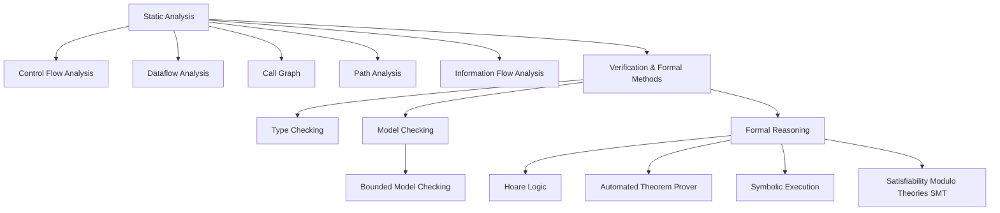

# Project cho môn học IT4508E — Software Security

# 1. Kiểm thử phần mềm là gì

Kiểm thử phần mềm là cố gắng tìm ra các lỗi/chứng minh không tồn tại lỗi để đảm bảo phần mềm hoạt động an toàn, đáng tin cậy. Để đảm báo phần mềm được kiểm thử đầy đủ, người ta thường dựa vào các tiêu chí như:

- **Statement** coverage (cấp độ câu lệnh): Kiểm tra xem mỗi câu lệnh trong chương trình được chạy ít nhất một lần, tức với đoạn code trên chỉ cần đảm bảo chạy được câu lệnh if và câu lệnh gán y = z là được, trường hợp x <= 0 không cần xét tới.

- **Branch** coverage (cấp độ nhánh): Kiểm tra xem mỗi nhánh của các câu lệnh điều khiển (if, switch, loop) được chạy ít nhất một lần, tức với đoạn code trên cần xét cả hai trường hợp x > 0 và x <= 0 để đảm bảo cả hai nhánh của câu lệnh if đều được thực thi.

- **Path** coverage (cấp độ đường đi): Kiểm tra xem tất cả các đường đi có thể có trong chương trình được chạy ít nhất một lần, tức với đoạn code trên cần xét tất cả các tổ hợp có thể của các câu lệnh điều khiển trong chương trình để đảm bảo mọi đường đi đều được thực thi.

- **Data** coverage (cấp độ dữ liệu): Theo dõi giá trị của các biến trong suốt chương trình. Không chỉ quan tâm đi đường nào (path constraints) mà còn quan tâm giá trị biến thay đổi ra sao


Có hai phương pháp kiểm thử chính:


| Tính chất      | Static Analysis (Phân tích Tĩnh)                                   | Dynamic Analysis (Phân tích Động)                         |
|---------------|---------------------------------------------------------------------|-----------------------------------------------------------|
| Cách làm      |  Đánh giá mã nguồn, mã bytecode hoặc mã nhị phân của ứng dụng mà không cần thực thi chương trình. Phương pháp này dựa trên việc xây dựng các mô hình trừu tượng của mã nguồn, chẳng hạn như Cây Cú pháp Trừu tượng (Abstract Syntax Tree - AST) hoặc Đồ thị Luồng Điều khiển (Control Flow Graph - CFG), để tìm kiếm các mẫu mã không an toàn hoặc các vi phạm về logic.  |Các công cụ thực thi chương trình, gửi các đầu vào và quan sát hành vi phản hồi của hệ thống |
| Độ bao phủ    | Có thể bao phủ tất cả các đường đi và đầu vào có thể có      | Chỉ kiểm tra được các đường đi mà bộ test kích hoạt       |
| Chứng minh    | Có thể chứng minh không bao giờ xảy ra loại lỗi này bằng cách chứng minh tính đúng dắn của phương trình biến đổi toán học | Không thể chứng minh không thể xảy ra loại lỗi này, chỉ có thể chứng minh phản chứng bằng sự hiện diện của lỗi |
| Kết quả       | Có thể có False Positives (Báo động giả) do báo lỗi ở chỗ thực ra không có lỗi | Không có False Positives, nếu nó báo lỗi (ví dụ: crash) thì đó 100% là lỗi thật |

## 1.1 Các kỹ thuật trong phân tích tĩnh




- **Control Flow Analysis** Xác định thứ tự các câu lệnh sẽ được thực thi từ đó công cụ sẽ xây dựng Biểu đồ Luồng Điều khiển (CFG) để hình dung các rẽ nhánh và vòng lặp. 

- **Dataflow Analysis** Theo dõi cách các biến được định nghĩa và sử dụng dọc theo các đường đi của chương trình. Nó giúp phát hiện các lỗi như sử dụng biến chưa được khởi tạo.

- **Call Graph** Xác định mối quan hệ phụ thuộc giữa các hàm và module. Đây là bước quan trọng để thực hiện phân tích xuyên suốt các thủ tục 
(inter-procedural analysis).

- **Path Analysis** Kiểm tra các chuỗi lệnh cụ thể trong chương trình để xác định tính khả thi. Mục tiêu là tìm ra các tổ hợp đầu vào có thể kích hoạt các lỗi tiềm ẩn.

- **Information Flow Analysis** Theo dõi sự lan truyền của dữ liệu nhạy cảm hoặc không an toàn. Đảm bảo dữ liệu từ nguồn không tin cậy không bị rò rỉ hoặc bị lạm dụng.

- **Verification & Formal Methods (Kỹ thuật Kiểm chứng và Hình thức)** Sử dụng các phương pháp toán học để chứng minh tính đúng đắn của chương trình. Một số kỹ thuật phổ biến bao gồm:

  - **Type Checking**: Đảm bảo các biến được sử dụng đúng với kiểu dữ liệu đã khai báo. Nó phát hiện lỗi logic về kiểu dữ liệu, ví dụ: gán chuỗi cho một biến kiểu int ngay tại thời điểm biên dịch với các ngôn ngữ là static type checking (C, Java, Rust, ...) hoặc tại runtime với các ngôn ngữ là dynamic type checking (Python, JavaScript, ...).

   - **Model Checking**: Xây dựng một mô hình đơn giản hóa của chương trình, ví dụ: một biểu đồ các trạng thái có thể có -> viết một đặc tả là một quy tắc mà chương trình phải tuân theo, ví dụ: "biến lock không bao giờ được hai luồng giữ cùng lúc" -> Công cụ Model Checker sẽ duyệt toàn bộ các trạng thái trong mô hình để xem nó có vi phạm quy tắc không. Công cụ điển hình là **Microsoft SLAM**, **SPIN**.

        

    - **Formal Reasoning** Sử dụng logic toán học để chứng minh các thuộc tính của chương trình, gồm có các phương pháp như:

        - **Hoare Logic**: Sử dụng bộ ba Hoare {P}S{Q} với P là điều kiện trước, Q là điều kiện sau và S là đoạn mã cần chứng minh. Bộ ba này khẳng định rằng nếu chương trình S bắt đầu với điều kiện P đúng, nó sẽ kết thúc với điều kiện Q đúng. Ví dụ thực tế được dùng trong SPARK Ada.

        - **Automated Theorem Prover**: Công cụ tự động sử dụng logic (như logic bậc nhất) để chứng minh các định lý về chương trình. Mục tiêu của ATP là chứng minh rằng một khẳng định (định lý) luôn đúng trong mọi trường hợp (tức là luôn hợp lệ theo logic), dựa trên một tập hợp các tiên đề hoặc giả định.

        - **Symbolic Execution**: Thực thi chương trình với các giá trị biểu tượng (symbolic values) thay vì giá trị cụ thể (concrete values). Kỹ thuật này thu thập các ràng buộc đường dẫn sao cho tối ưu bao phủ tối đa các đường đi của mã. Các ràng buộc này sau đó được gửi cho các SMT Solver giải. Công cụ phổ biến bao gồm **Microsoft SAGE**, **ESBMC**.

        - **Satisfiability Modulo Theories (SMT)**: Từ các ràng buộc do Symbolic Execution tạo ra, SMT Solver sẽ giải quyết các công thức logic phức tạp để xác định tính khả thi của các đường dẫn trong chương trình. Một vài công cụ SMT phổ biến là **Z3**, **CVC5**, **Boolector**

## 1.2 Các kỹ thuật trong phân tích động

````mermaid
flowchart TD
    A[Dynamic Analysis] --> B[Instrumentation & Profiling]
    A --> C[Fuzzing]
    A --> D[Sanitizers Runtime Sanity Checks]
    A --> E[Dynamic Taint / Information Flow Tracking]
    A --> F[Dynamic Symbolic Execution / Concolic Testing]
    A --> G[Memory & Thread Error Detection]
    A --> H[Tracing & Tracing Frameworks]

    G --> G1[Memory Leak Detection]
    G --> G2[Race Condition / Data Race Detection]

    H --> H1[Dynamic Tracing]
    H --> H2[Binary Instrumentation Pin, DynamoRIO]
````

- **Instrumentation & Profiling**: Chèn code hoặc dùng công cụ runtime để thu thập thông tin hiệu năng (CPU, thời gian, sử dụng bộ nhớ), giúp hiểu điểm nghẽn (bottleneck) và tối ưu hóa phần mềm.

- **Sanitizers (Runtime Sanity Checks)**: Công cụ như AddressSanitizer (ASan), UndefinedBehaviorSanitizer (UBSan) chèn kiểm tra thời gian chạy để phát hiện lỗi bộ nhớ (overflow, dùng sau khi free, uninitialized) hoặc hành vi không xác định.

- **Dynamic Taint / Information Flow Tracking**: Gắn các “nhãn” (taint) cho dữ liệu đầu vào hoặc biến, theo dõi cách dữ liệu này lan truyền qua chương trình lúc chạy để phát hiện rò rỉ, injection hoặc lỗ hổng bảo mật.

- **Dynamic Symbolic Execution / Concolic Testing**: Kết hợp thực thi thực tế (concrete) và symbolic execution để tạo ra đầu vào mới kiểm thử các đường đi khó hoặc chưa được cover.

- **Memory & Thread Error Detection**:

    -   Memory Leak Detection: Phát hiện vùng nhớ được cấp phát mà không được giải phóng.

    -   Race Condition: Phát hiện điều kiện tranh chấp (data race) trong chương trình đa luồng.

- **Tracing & Tracing Frameworks**:

    - Dynamic Tracing (DTrace): Theo dõi sự kiện hệ thống, hàm, gọi hàm… thời gian chạy để hiểu hành vi phần mềm. 
Wikipedia

    - Binary Instrumentation (Pin, DynamoRIO): Chèn instrumentation vào file nhị phân hoặc khi load, để phân tích runtime mà không cần source code. Ví dụ: Intel Pin là framework instrumentation. 

- **Fuzzing**: Sinh đầu vào ngẫu nhiên hoặc biến đổi từ một đầu vào ban đầu, đẩy các đầu vào này cho chương trình mục tiêu, quan sát phản hồi (crash, lỗi, treo) để tìm lỗi.


    


Cụ thể hơn vầ các loại fuzzing:

1. **Dumb/random fuzzing/Black-box** (ví dụ công cụ Radamsa): Tạo các đầu vào ngẫu nhiên hoàn toàn mà không có cấu trúc hay định dạng cụ thể. Hiệu quả thường thấp và chỉ dò ra các lỗi cú pháp, không dò được các lỗi nghiệp vụ phức tạp. Có thể thử:
    - Input rất dài, rất ngắn, để trống
    - Các giá trị biên, giá trị âm, giá trị cực lớn
    - Các ký tự đặc biệt như null, newline, %s, %x, ;, ', /, v.v hay các từ ngữ đặc biệt theo ứng dụng như SQL keywords, HTML tags, script tags, v.v

2. **Mutation-based fuzzing**: Bắt đầu từ các đầu vào hợp lệ và thực hiện các biến đổi (mutation) nhỏ để tạo ra các đầu vào mới. Hiệu quả hơn basic fuzzing vì giữ được cấu trúc cơ bản của dữ liệu. Ví dụ:
    - Thay đổi một số byte trong file ảnh hợp lệ để tạo ra file ảnh mới
    - Thêm, xóa, hoặc thay thế các trường trong file JSON hoặc XML hợp lệ
    - Thay đổi các tham số URL trong các request HTTP hợp lệ

3. **Generation-based fuzzing/grammar-based/model-based**: Tạo các đầu vào từ đầu dựa trên một mô hình hoặc định dạng cụ thể(vd như cấu trúc gói tin, cấu trúc request). Cách thức: Tạo ra các gói tin "hơi sai lệch" (malformed), sai độ dài, hoặc rơi vào các trường hợp biên (corner cases) để kiểm tra xem hệ thống có xử lý lỗi đúng cách hay bị crash. Hiệu quả cao nhất vì có thể kiểm soát cấu trúc và nội dung của dữ liệu. Tuy nhiên cần tinh chỉnh/ tạo fuzzer riêng. Thường dùng cho các giao thức giao tiếp (như GSM, SMS).

4. **Evolutionary / Greybox** (Tiến hóa - VD: công cụ AFL): Công cụ sử dụng một lượng nhỏ thông tin từ chương trình (thường là code coverage thu được qua instrumentation) để dẫn dắt quá trình sinh dữ liệu. Nếu một đầu vào kích hoạt một nhánh mã mới, nó sẽ được giữ lại làm hạt giống (seed) cho thế hệ tiếp theo.


5. **Whitebox** (VD: SAGE): Dùng kỹ thuật Symbolic Execution để phân tích mã nguồn, tính toán chính xác giá trị input cần thiết để đi vào các nhánh code khó.


> [!NOTE]
> Công cụ AFL đã ngưng cập nhật từ 2017, sử dụng AFL++ hoặc AFLnet (cho network protocol) thay thế.

# 2. Các công cụ được sử dụng

## 2.1 ESBMC


### Cơ sở lý thuyết

ESBMC (the Efficient SMT-based Context-Bounded Model Checker) là một công cụ hoạt động dựa trên cơ sở lý thuyết của:

- Kỹ thuật **Symbolic Execution** -> SMT: đã được mô tả ở trên
- Kỹ thuật **Bounded Model Checking (BMC)**: là một kỹ thuật trong nhóm **Model Checking**. Theo như đã mô tả phía bên trên thì Model Checking sẽ xây dựng một mô hình của chương trình và duyệt toàn bộ các trạng thái trong mô hình để xem nó có vi phạm quy tắc không. Tuy nhiên điều này sẽ gây ra một vấn đề lớn là **hiệu ứng nổ trạng thái (state explosion problem)** nếu chương trình có chứa **vòng lặp**, **hàm đệ quy** do các công cụ này tạo ra các công thức toán dựa vào các câu lệnh if/else -> Khi gặp vòng lặp/hàm đệ quy thì công cụ sẽ cần phải **unroll/unwind** chúng ra thành các câu lệnh if/else để phân tích, ví dụ:

```c
int main() {
    int sum = 0;
    for (int i = 0; i < 3; i++) {
        sum += i;
    }
    assert(sum == 3);
    return 0;
}
```

Sẽ được unroll thành:

```c
int main() {
    int sum = 0;
    int i = 0;

    // Unroll lần 1
    if (i < 3) {
        sum += i;      // sum += 0
        i = i + 1;     // i = 1
    }

    // Unroll lần 2
    if (i < 3) {
        sum += i;      // sum += 1
        i = i + 1;     // i = 2
    }

    // Unroll lần 3
    if (i < 3) {
        sum += i;      // sum += 2
        i = i + 1;     // i = 3
    }

    // Sau khi unroll 3 lần, CBMC thêm “unwinding assertion”:
    // nó sẽ kiểm tra rằng vòng lặp *phải dừng lại* tại đây
    // tức là điều kiện “i < 4” phải là false nếu đã unroll đủ:
    assert(!(i < 4));

    // Cuối cùng tiếp tục phần còn lại
    assert(sum == 3);

    return 0;
}
```

Sau đó mới từ các lệnh này để tạo các công thức logic cho SMT giải quyết. Vấn đề là nếu vòng lặp/hàm đệ quy có thể chạy rất nhiều lần (hoặc vô hạn) thì việc unroll/unwind này sẽ tạo ra một lượng lớn các câu lệnh if/else, dẫn đến việc công thức logic trở nên quá phức tạp -> các công cụ SMT không thể giải được.

Do đó Bounded Model Checking sẽ giới hạn số lần unroll/unwind này bằng một con số cố định do người dùng cung cấp (ví dụ: với ESBMC là dùng thêm flag `--unwind <k>`) -> công cụ chỉ unroll/unwind vòng lặp/hàm đệ quy tối đa k lần. 

Tuy nhiên, do chỉ unroll đến k lần, nên có thể bỏ sót các lỗi xảy ra sau k lần lặp. Ví dụ với:

```c
int main() {
    int y = 0;
    for (int i = 0; i < 3; i++) {
        if (i == 2) {
            // Tại lần lặp thứ 3, y = 6
            // Nên đánh giá y != 6 để raise lỗi
            assert(y != 6);
        }
        y += 2;  
    }
    return 0;
}
```
Vòng for lặp 3 lần: i = 0,1,2. `y` sau mỗi lần lặp:

- sau `i` = 0 → `y` = 2

- sau `i` = 1 → `y` = 4

- sau `i` = 2 → `y` = 6. Tại đây sẽ raise lỗi do `assert(y != 6)` bị vi phạm.

Tuy nhiên khi chạy, nếu người dùng chỉ dùng `--unwind 2` thì vòng lặp chỉ được unroll 2 lần, nên công cụ sẽ không phát hiện lỗi tại `i == 2` vì vòng lặp chưa được unroll đến lần thứ 3. Do đó người dùng cần chọn giá trị k sao cho phù hợp để cân bằng giữa hiệu suất và độ bao phủ lỗi.

> [!TIP]
> Dùng thêm flag `--unwinding-assertions` thì ESBMC sẽ cảnh báo nếu unroll chưa hết vòng lặp.

Như vậy công thức toán được tạo ra khi này khi đưa vào SMT solver nếu:

- Tìm được nghiệm (tức có lỗi) -> chương trình có lỗi
- Không tìm được nghiệm -> **không chắc** chương trình đúng, vì có thể lỗi xảy ra sau k lần unroll


Để giải quyết điều này, ESBMC có thêm một kỹ thuật gọi là **k-induction**. Cụ thể, nó là mở rộng của BMC để chứng minh **an toàn tuyệt đối**, gồm 3 bước:

1. **Base Case**: Giống như BMC, ESBMC sẽ unroll vòng lặp/hàm đệ quy k lần và kiểm tra xem có lỗi nào xảy ra trong các lần unroll này không. Nếu tìm thấy lỗi, quá trình dừng lại và báo lỗi, còn nếu không sang bước 2.

2. **Inductive Step**: Kiểm tra xem nếu chương trình an toàn sau k lần unroll -> nó cũng sẽ an toàn sau k+1 lần unroll. Điều này được thực hiện bằng cách thêm các điều kiện giả định vào công thức toán để biểu thị rằng chương trình đã an toàn sau k lần unroll, và sau đó kiểm tra xem có lỗi nào xảy ra khi unroll thêm một lần nữa không. Giống cách chứng minh **quy nạp** toán học.

- **Forward Condition**: Kiểm tra xem vòng lặp có thể chạy vô hạn mà không phá vỡ giả định

Thêm flag `--k-induction` để bật tính năng này trong ESBMC.

### Quá trình hoạt động của ESBMC

Đó là về khía cạnh lý thuyết, về mặt implementation, ESBMC hoạt động theo các giai đoạn sau:


Để đi theo quá trình hoạt động này, ta sử dụng một đoạn code mẫu:

```c
#include <assert.h>

int main() {
    int x = 5;
    if (x > 0) {
        x = x + 1;
    }
    // Chúng ta mong muốn x phải bằng 10 (thực tế code trên x = 6, nên sẽ có lỗi)
    assert(x == 10); 
    return 0;
}
```

**1. Phân tích Cú pháp**

ESBMC bắt đầu bằng cách đọc mã nguồn C sử dụng Clang (một trình biên dịch) để quét và phân tích mã.

Kết quả là một **AST** (Abstract Syntax Tree - Cây cú pháp trừu tượng). Đây là cấu trúc dạng cây biểu diễn code để máy tính hiểu ngữ pháp đâu là biến, đâu là hàm, đâu là lệnh if. Sau đó, ESBMC chuyển đổi AST của Clang sang định dạng nội bộ của riêng nó (**ESBMC AST**).

minh hoạ dùng command này để in AST của Clang:

```bash
clang -Xclang -ast-dump -c test.c
```

```c
TranslationUnitDecl 0x58122e657288 <<invalid sloc>> <invalid sloc>
|-TypedefDecl 0x58122e657ab8 <<invalid sloc>> <invalid sloc> implicit __int128_t '__int128'
| `-BuiltinType 0x58122e657850 '__int128'
|-TypedefDecl 0x58122e657b28 <<invalid sloc>> <invalid sloc> implicit __uint128_t 'unsigned __int128'
| `-BuiltinType 0x58122e657870 'unsigned __int128'
|-TypedefDecl 0x58122e657e30 <<invalid sloc>> <invalid sloc> implicit __NSConstantString 'struct __NSConstantString_tag'
| `-RecordType 0x58122e657c00 'struct __NSConstantString_tag'
|   `-Record 0x58122e657b80 '__NSConstantString_tag'
|-TypedefDecl 0x58122e657ed8 <<invalid sloc>> <invalid sloc> implicit __builtin_ms_va_list 'char *'
| `-PointerType 0x58122e657e90 'char *'
|   `-BuiltinType 0x58122e657330 'char'
|-TypedefDecl 0x58122e6581d0 <<invalid sloc>> <invalid sloc> implicit __builtin_va_list 'struct __va_list_tag[1]'
| `-ConstantArrayType 0x58122e658170 'struct __va_list_tag[1]' 1 
|   `-RecordType 0x58122e657fb0 'struct __va_list_tag'
|     `-Record 0x58122e657f30 '__va_list_tag'
|-FunctionDecl 0x58122e6caf90 </usr/include/assert.h:69:1, line:71:43> line:69:13 used __assert_fail 'void (const char *, const char *, unsigned int, const char *) __attribute__((noreturn))' extern
| |-ParmVarDecl 0x58122e6cacc0 <col:28, col:40> col:40 __assertion 'const char *'
| |-ParmVarDecl 0x58122e6cad40 <col:53, col:65> col:65 __file 'const char *'
| |-ParmVarDecl 0x58122e6cadc0 <line:70:7, col:20> col:20 __line 'unsigned int'
| |-ParmVarDecl 0x58122e6cae40 <col:28, col:40> col:40 __function 'const char *'
| `-NoThrowAttr 0x58122e6cb058 </usr/include/x86_64-linux-gnu/sys/cdefs.h:79:35>
....
```
Kết quả sẽ là một danh sách dài các node như `VarDecl` (khai báo biến), `IfStmt` (lệnh if), v.v.

Hoặc dùng command này để in ra ESBMC AST:

```bash
esbmc test.c --parse-tree-only
```

**2. Chuyển đổi sang chương trình GOTO (Control Flow Graph)**

Code C có nhiều cấu trúc phức tạp (while, for, do-while, switch). Để dễ xử lý toán học, ESBMC đơn giản hóa tất cả về dạng GOTO Program. Nó tạo ra một CFG (Control Flow Graph - Đồ thị luồng điều khiển). Mọi vòng lặp hay rẽ nhánh đều được biến thành các lệnh nhảy (goto) đơn giản.

Minh họa cách xem: Dùng lệnh ESBMC để xem chương trình sau khi chuyển thành GOTO:

```bash
esbmc test.c --goto-functions-only
```

```
ESBMC version 7.11.0 64-bit x86_64 linux
Target: 64-bit little-endian x86_64-unknown-linux with esbmclibc
Parsing test.c
Converting
Generating GOTO Program
GOTO program creation time: 0.108s
GOTO program processing time: 0.000s
....

main (c:@F@main):
        // 15 file test.c line 4 column 5 function main
        DECL signed int x;
        // 16 file test.c line 4 column 5 function main
        ASSIGN x=5;
        // 17 file test.c line 5 column 5 function main
        IF !(x > 0) THEN GOTO 1
        // 18 file test.c line 6 column 9 function main
        ASSIGN x=x + 1;
        // 19 file test.c line 9 column 5 function main
     1: ASSERT x == 10 // assertion x == 10
        // 20 file test.c line 10 column 5 function main
        RETURN: 0
        // 21 file test.c line 11 column 1 function main
        END_FUNCTION // main
```

**3. Thực thi Ký hiệu (Symbolic Execution) & SSA**

Thay vì chạy code với giá trị cụ thể, ESBMC thực hiện Symbolic Execution. Nó chuyển code sang dạng SSA (Static Single Assignment). Trong SSA, mỗi biến chỉ được gán giá trị một lần duy nhất. Nếu biến x thay đổi giá trị, nó sẽ tạo ra phiên bản mới x_1, x_2.

Tại bước này, các vòng lặp cũng được **unrolled** một số lần (độ sâu) nhất định (gọi là bound k).

Minh họa SSA: Từ code gốc:

```c
x = 5;      // x_1
x = x + 1;  // x_2
```

ESBMC sẽ hiểu thành công thức: x<sub>1</sub>=5, 
x<sub>2</sub>=x<sub>1</sub>+1

Minh họa SSA dùng lệnh ESBMC:

```bash
esbmc test.c --ssa-symbol-table
```

**4. Tạo công thức xác minh & Bộ giải SMT**

Sau khi chương trình được mở cuộn đến độ sâu k, ESBMC sẽ chuyển đổi toàn bộ chương trình thành một Công thức Logic (Logic Formula) khổng lồ.

Công thức này bao gồm hai phần chính:


- $C_k$ (Điều kiện Hạn chế/Constraints): Đây là một công thức logic mô tả tất cả các trạng thái và phép biến đổi hợp lệ của chương trình dọc theo lộ trình thực thi k bước. Nó chuyển đổi:

    - Tất cả các phép gán biến (biến đổi trạng thái).
    - Tất cả các điều kiện nhánh (như if, else, switch) đã được chọn để thực thi.

- $¬P$ (Phủ định Thuộc tính An toàn): Đây là một công thức logic mô tả trạng thái lỗi mà bạn muốn kiểm tra (ví dụ: truy cập ngoài giới hạn mảng, chia cho 0, tràn số nguyên, hay điều kiện trong assert(P) bị vi phạm).

Sau đó ESBMC gửi công thức:

> $ψ_k = C_k ∧ ¬P$ 

này đến một Bộ giải SMT. Ý nghĩa của công thức này là Liệu có tồn tại một tập hợp các giá trị đầu vào và một lộ trình thực thi k bước ($C_k$​) mà đồng thời dẫn đến trạng thái lỗi ($¬P$) hay không?

Minh họa cách xem: Để xem các công thức toán học mà nó gửi cho SMT solver:
    
```bash
esbmc test.c --smt-formula-only
```

```
(set-logic QF_BV)
(declare-fun __ESBMC_ptr_obj_start_0 () (_ BitVec 64))
(declare-fun __ESBMC_ptr_obj_end_0 () (_ BitVec 64))
(declare-fun __ESBMC_ptr_obj_start_1 () (_ BitVec 64))
(declare-fun __ESBMC_ptr_obj_end_1 () (_ BitVec 64))
....
 (= #b1111111111111111111111111111111111111111111111111111111111111111 __ESBMC_ptr_obj_end_1))
(assert 
 (= __ESBMC_ptr_obj_end_0 |smt_conv::__ESBMC_ptr_addr_range_0..end0|))
(assert 
 (= __ESBMC_ptr_obj_start_0 |smt_conv::__ESBMC_ptr_addr_range_0..start0|))
(assert 
 (= __ESBMC_ptr_obj_end_1 |smt_conv::__ESBMC_ptr_addr_range_1..end0|))
(assert 
 (= __ESBMC_ptr_obj_start_1 |smt_conv::__ESBMC_ptr_addr_range_1..start0|))
(assert 
 (= |smt_conv::smt_conv::collate_array_vals::3..end0| |smt_conv::smt_conv::collate_array_vals::4..end0|))
(assert 
 (= |smt_conv::smt_conv::collate_array_vals::3..start0| |smt_conv::smt_conv::collate_array_vals::4..start0|))
(assert 
 (= __ESBMC_ptr_obj_end_0 |smt_conv::smt_conv::collate_array_vals::7..end0|))
(assert 
 (= __ESBMC_ptr_obj_start_0 |smt_conv::smt_conv::collate_array_vals::7..start0|))
(assert (distinct |execution_statet::\guard_exec?0!0| #b0))
(check-sat)
(exit)
```

**5. SMT Solver giải quyết**

ESBMC sử dụng các SMT Solver như Z3, CVC5 để giải công thức $ψ_k$. Bộ giải sẽ trả về:

- Nếu $ψ_k$​ là Thỏa mãn: SMT solver trả lời `VERIFICATION FAILED` và cung cấp một ví dụ phản chứng là một tập hợp các giá trị cụ thể cho các biến đầu vào và một chuỗi các bước thực thi từ đó có thể xảy ra lỗi. Chương trình có lỗi ở độ sâu $≤ k$.

- Nếu $ψ_k$​ là Không Thỏa mãn: SMT solver trả lời `VERIFICATION SUCCESSFUL`. Điều này có nghĩa là không thể xảy ra lỗi trong $k$ bước thực thi đầu tiên.

Để minh họa chạy lệnh:

```bash
esbmc test.c
```

Nếu có lỗi, output sẽ là:

```
[Counterexample]


State 1 file test.c line 9 column 5 function main thread 0
----------------------------------------------------
Violated property:
  file test.c line 9 column 5 function main
  assertion x == 10
  x == 10


VERIFICATION FAILED
```

Nếu không có lỗi (đổi `assert(x == 10)` thành `assert(x == 6)`), output sẽ là:

```
VERIFICATION SUCCESSFUL
```

## 2.2 AFL++


### Quá trình hoạt động của AFL++

#### Cách AFL++ theo dõi độ bao phủ code (Code Coverage)

Nếu một input mới làm chương trình chạy vào một nhánh code chừa từng đi qua trước đây, AFL sẽ coi đó là một **interesting input** và sẽ giữ lại để khai thác tiếp. Cụ thể:


*Fig 1 Quy trình hoạt động của AFL++*

Với các input trong danh sách, mỗi input được chạy, AFL sẽ ghi lại các nhánh được chạy. Nó làm vậy bằng cách theo dõi các lệnh Jump trong mã ASM. 


Các nhánh mà input đi qua được biểu diễn bằng một bản đồ bitmap (trong AFL thì bản đồ này có kích thước **64KB**):

> [!NOTE]
> Kích thước 64KB để bảng đủ nhỏ để nằm trong L2 Cache của CPU, giúp truy cập nhanh hơn trong quá trình fuzzing liên tục.

- Mỗi ô vuông trong bảng đại diện cho một Cạnh (Edge) - tức là một bước nhảy từ vị trí A sang vị trí B. 
Lưu lại nếu độ bao phủ tăng.
- Các dấu tích (✓) trong hình (như ✓1, ✓2, ✓3) có nghĩa là: "À, trong lần chạy này, code đã thực hiện bước nhảy đó rồi".

Để có thể ghi lại các bước nhảy vào bản đồ bitmap, AFL sử dụng một kỹ thuật gọi là **instrumentation** (chèn mã theo dõi) vào mã nguồn hoặc mã máy của chương trình mục tiêu. AFL dùng trình biên dịch riêng như `afl-gcc`, `afl-clang` hoặc `afl-clang-fast` (sử dụng LLVM Pass) để chèn các đoạn mã assembly nhỏ (**trampolines**) theo dõi vào đầu mỗi khối cơ bản (basic block - một đoạn mã không có lệnh rẽ nhánh). Công thức cập nhật trạng thái của AFL++ là:

> Map[Current_Location⊕(Previous_Location>>1)]++

Ví dụ thực tế:

```
cur_location = <COMPILE_TIME_RANDOM_FOR_THIS_CODE_BLOCK>;
shared_mem[cur_location ^ prev_location]++;
prev_location = cur_location >> 1;
```

Với:

- `cur_location`: ID ngẫu nhiên của khối hiện tại.

- `prev_location`: ID của khối trước đó.

- `shared_mem`: Một bitmap 64KB nằm trong bộ nhớ chia sẻ. Phép XOR (^) tạo ra một định danh duy nhất cho cạnh (edge) nối giữa hai khối (từ A đến B). Phép dịch phải (>> 1) giúp phân biệt hướng đi (A->B khác với B->A).  Ví dụ nếu code chạy từ dòng 2 xuống dòng 6 -> Nó đánh dấu vào ô tọa độ (2, 6). 

*Mỗi basic code block được AFL gán một giá trị ngẫu nhiên cố định tại thời điểm biên dịch (COMPILE_TIME_RANDOM_FOR_THIS_CODE_BLOCK) để xác định vị trí hiện tại (Current_Location).*


*Nếu không có source (chỉ có file .exe): AFL dùng chế độ **QEMU mode** (chạy giả lập) để theo dõi, nhưng sẽ chậm hơn.*

Đó là cách AFL++ theo dõi chương trình  mục tiêu để tối ưu hóa độ bao phủ mã trong quá trình fuzzing. Việc tối ưu này được thực hiện thông qua Giải Thuật Di Truyền (Genetic Algorithm)


#### Giải Thuật Di Truyền (Genetic Algorithm)


1. AFL++ quản lý một hàng đợi các đầu vào interesting inputs. Nó chọn một đầu vào từ hàng đợi, ưu tiên các đầu vào nhỏ và chạy nhanh, ví dụ chuỗi `Hello` -> Chương trình chạy: Dòng 1 -> 6 -> 9 -> 10 -> 15 (xem Fig 1) => AFL đánh dấu các ô tương ứng trên Bitmap.

2. AFL tạo ra Input 2 (Mutation): Sửa đổi interesting input vừa rồi bằng cách:

    - **Deterministic Phase**: Thực hiện lần lượt các đột biến xác định như:
        - Bit Flips: Lật từng bit trong đầu vào.

        - Integer Arithmetic: Cộng hoặc trừ các giá trị số nguyên nhỏ (ví dụ: 1,−1,INT_MAX,INT_MIN) vào các vị trí dữ liệu.

        - Dictionary Insertion: Chèn các token hoặc chuỗi ký tự đã biết (được trích xuất từ chương trình hoặc do người dùng cung cấp) vào đầu vào.
    
    
        Giai đoạn này đảm bảo không bỏ sót các lỗi biên đơn giản.  

    - **Havoc Phase**: Nếu giai đoạn xác định không tìm thấy đường đi mới, AFL++ chuyển sang chế độ "hỗn loạn" (havoc), áp dụng hàng loạt đột biến ngẫu nhiên xếp chồng lên nhau.

    - **Splicing**: Cắt ghép hai đầu vào khác nhau trong hàng đợi để tạo ra "con lai", hy vọng kết hợp được các đặc tính tốt của cả hai.   

    - **MOpt**: AFL++ còn tích hợp MOpt, một trình đột biến dựa trên học máy (meta-heuristic mutator) để tối ưu hóa việc lựa chọn các đột biến.

    Ví dụ `Hello` thành `Hello\0`  -> Chương trình chạy đến dòng 5: JZ 7 (Jump If Zero). Do có ký tự \0, điều kiện thỏa mãn => Chương trình nhảy sang Dòng 7: arraycopy(...).

3. Phản hồi:  Sau khi chạy, nếu bitmap coverage hiển thị một cạnh mới hoặc số lần thực thi cạnh thay đổi đáng kể, đầu vào đó được coi là "fittest" và được thêm vào hàng đợi để tiếp tục đột biến. 

    Ví dụ AFL thấy một bước nhảy từ 5 -> 7 => AFL tra vào Bitmap: "Ô đại diện cho bước nhảy 5->7 chưa từng được đánh dấu trước đây" => Input 2 đã khám phá ra vùng đất mới (code mới) => Lưu Input 2 lại vào hàng đợi để dùng làm hạt giống lai tạo ra các input tiếp theo. Các input tiếp theo được tạo mới theo Mutation Strategies như ở bước 2.

4. Kết quả: AFL++ lặp lại quá trình này liên tục, chạy vô tận đến khi người dùng dừng lại. Nếu trong quá trình chạy, nếu chương trình crash (sự cố) hoặc treo (hangs), AFL++ sẽ lưu đầu vào đó lại như một ví dụ phản chứng (counterexample).

#### Cách AFL++ tối ưu hiệu năng

Do cần test với số lượng các input,  AFL không chạy lại chương trình từ đầu mỗi lần cho mỗi input, mà nó sử dụng một kỹ thuật gọi là **fork server**. Quy tình đầy đủ của AFL là:

1. AFL khởi động chương trình mục tiêu một lần duy nhất, vd như khởi chạy hàm `main()`, tạo ra một tiến trình cha (parent process). Bắt đầu với các seed inputs

2. Mỗi khi cần test một input mới, AFL sử dụng hệ thống gọi `fork()` để tạo ra một tiến trình con (child process) từ tiến trình cha. Tiến trình con này sẽ thừa hưởng toàn bộ trạng thái bộ nhớ của tiến trình cha tại thời điểm fork. AFL từ input ban đầu sẽ tạo ra các input mới bằng cách đột biến (mutation) và gửi chúng vào tiến trình con này để chạy thử. (bit flips, tăng giảm số nguyên, xóa block...).

3. Tiến trình con sẽ chạy chương trình mục tiêu với input mới, trong khi tiến trình cha vẫn giữ nguyên trạng thái ban đầu, sẵn sàng để fork ra các tiến trình con tiếp theo.

4. Khi chạy, Thu thập thông tin bao phủ mã (CFG edges). Lưu lại nếu độ bao phủ tăng.

5. Lặp lại

Thêm nữa, trong môi trường C/C++, một chương trình có thể đọc **vượt quá giới hạn bộ đệm một vài byte** mà không gây ra crash ngay lập tức (do vùng nhớ lân cận chưa được sử dụng, do OS cấp phát thêm bộ nhớ một cách thụ động, ...), dẫn đến việc các lỗi này bị bỏ qua bởi các fuzzer thông thường. Để khắc phục, công nghệ Instrumentation (gắn mã theo dõi) được sử dụng, điển hình là AddressSanitizer (ASan).

ASan hoạt động dựa trên hai cơ chế chính:

- **Shadow Memory**: ASan dành riêng một vùng bộ nhớ ảo để theo dõi trạng thái của bộ nhớ ứng dụng. Tỷ lệ ánh xạ thường là 8:1, nghĩa là 8 byte bộ nhớ ứng dụng được mô tả bởi 1 byte shadow memory. Giá trị của byte shadow sẽ cho biết trạng thái của 8 byte kia (ví dụ: 0 là hợp lệ, các giá trị âm biểu thị vùng bị cấm như đã giải phóng, vùng đệm stack, v.v.).   

- **Redzones (Vùng đỏ)**: Trình biên dịch chèn các vùng bộ nhớ bị "đầu độc" (poisoned) xung quanh các biến trên stack và heap. Nếu chương trình truy cập vào vùng redzone (tràn bộ đệm), ASan sẽ kiểm tra shadow memory, phát hiện giá trị bị cấm và dừng chương trình ngay lập tức với báo cáo chi tiết.  

Việc sử dụng ASan là bắt buộc trong kế hoạch kiểm thử này để đảm bảo mọi vi phạm bộ nhớ đều được phát hiện bởi Radamsa và AFL++.

## 2.3 AddressSanitizer (ASan)

.....
