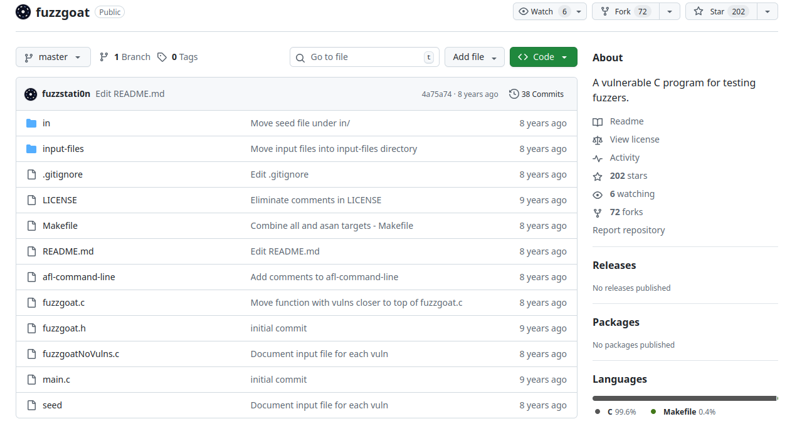
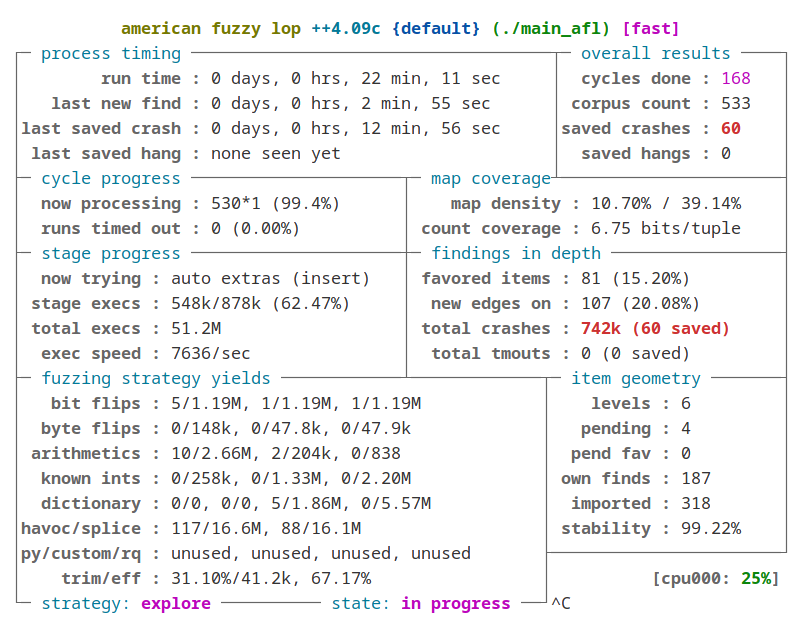
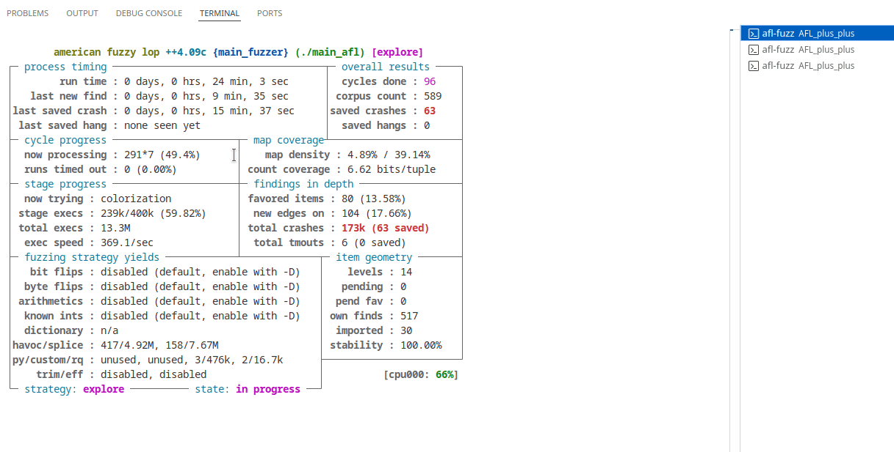
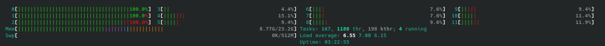

# Tổng quan chương trình fuzzgoat



**Fuzzgoat** là một chương trình C mã nguồn mở, được sửa đổi từ thư viện `udp/json-parser`. Chức năng chính của nó là đọc một tệp JSON từ đầu vào chuẩn (stdin) hoặc từ tệp, phân tích cú pháp và in ra cấu trúc dữ liệu tương ứng. 

Cụ thể chương trình hoạt động theo mô hình đệ quy (recursive descent parser). Nó đọc một chuỗi byte đầu vào và cố gắng xây dựng một cấu trúc dữ liệu cây đại diện cho đối tượng JSON.

- Input: File JSON hoặc luồng dữ liệu từ stdin.
- Process: Hàm json_parse gọi các hàm con để xử lý Object, Array, String, Number, Boolean, v.v.
- Output: Chương trình thường không in ra kết quả phân tích mà chỉ trả về mã thoát, trừ khi gặp lỗi crash do các lỗ hổng.


Cấu trúc thư mục:

```
fuzzgoat_source_code/
├── in/seed            # Chứa seed đầu vào cho AFL++ fuzzing
├── input-files        # Chứa các payload sẽ trigger lỗ hổng(dùng để đối chiếu kết quả)
├── fuzzgoat.c         # Mã nguồn chính của chương trình
├── fuzzgoat.h         # Khai báo hàm, macro cho fuzzgoat.c
├── main.c             # Hàm main để khởi động chương trình
└──  fuzzgoatNoVulns.c  # Phiên bản không có lỗ hổng của 
```

`main.c` là entry point khi chạy theo cách truyền thống (không fuzz), hoặc được dùng làm **harness** tối giản để AFL/LibFuzzer có điểm vào.

Với fuzzers như AFL++, harness thường là một chương trình có hàm main() đọc dữ liệu từ stdin hoặc @@ (đường dẫn file do AFL cấp) rồi chuyển dữ liệu đó vào hàm bạn muốn fuzz. Trong repo này, `main.c` chính là harness để chạy AFL++.

Biên dịch:

```bash
# Using -lm to link the math library
gcc main.c fuzzgoat.c -o fuzzgoat-bin  -lm
```

Chạy thử:

```bash
./fuzzgoat-bin test_sample.json
```

``` 
{
  "id": 1,
  "name": "Sample Item",
  "tags": ["test", "demo", "json"],
  "details": {
    "created_at": "2025-01-01",
    "description": "This is a dummy JSON object."
  }
}

--------------------------------

 object[0].name = id
  int:          1
 object[1].name = name
  string: Sample Item
 object[2].name = tags
  array
   string: test
   string: demo
   string: json
 object[3].name = details
   object[0].name = created_at
    string: 2025-01-01
   object[1].name = description
    string: This is a dummy JSON object.
Segmentation fault (core dumped)
```


Mã nguồn của Fuzzgoat (`fuzzgoat.c`) tương đối nhỏ gọn (~1200 dòng). Fuzzgoat được cấy ghép nhiều lỗ hổng điển hình để làm thước đo cho các công cụ kiểm thử. Các lỗ hổng này đã được comment lại trong mã nguồn. Bảng dưới đây tóm tắt các lỗ hổng chính cần tìm:

**1. Lỗ hổng Use After Free (Sử dụng bộ nhớ sau khi giải phóng)**

- **Vị trí**: Hàm `new_value`, bên trong `case json_array`.

```c
if (value->u.array.length == 0)
{
   free(*top); // Dòng gây lỗi
   break;
}
```

- **Phân tích nguyên nhân**: Khi trình phân tích cú pháp (parser) gặp một mảng JSON rỗng (`[]`), nó thực hiện lệnh `free(*top)` để giải phóng khối nhớ được trỏ bởi `*top`. Tuy nhiên, con trỏ này không được gán lại thành `NULL` hoặc được xử lý đúng cách để ngăn chặn việc truy cập sau đó. Chương trình vẫn tiếp tục chạy và cố gắng sử dụng vùng nhớ đã bị giải phóng này ở các bước tiếp theo.


- **Hậu quả**: Gây ra lỗi hư hỏng bộ nhớ (memory corruption), có thể dẫn đến crash chương trình hoặc trong các tình huống thực tế nghiêm trọng hơn là thực thi mã tùy ý (arbitrary code execution).

- **Cách kích hoạt**: Sử dụng input là một mảng JSON rỗng: 
  - Payload: `[]`
  - File mẫu: `input-files/emptyArray`

**2. Lỗ hổng Out-of-bounds Read / Invalid Free (Đọc ngoài vùng nhớ / Giải phóng sai)**

- **Vị trí**: Hàm `json_value_free_ex`, bên trong case `json_object`

```c
value = value->u.object.values [value->u.object.length--].value;
```

- **Phân tích nguyên nhân**: Đoạn mã sử dụng toán tử giảm sau (post-decrement) `length--` làm chỉ số mảng.

  - Nếu mảng có độ dài là `N`, các chỉ số hợp lệ là từ `0` đến `N-1`.

  - Việc sử dụng `[length--]` sẽ truy cập vào phần tử tại chỉ số `N` (vượt quá giới hạn mảng), sau đó mới giảm giá trị `length`. Điều này dẫn đến việc đọc dữ liệu rác hoặc dữ liệu không thuộc quyền quản lý của mảng đó.

- **Hậu quả**: `free()` yêu cầu con trỏ phải trỏ chính xác vào đầu vùng nhớ được cấp phát bởi `malloc()`. Việc truyền một con trỏ sai lệch (trỏ vào redzone hoặc metadata của allocator) sẽ gây ra lỗi Invalid Free hoặc làm hỏng cấu trúc heap (heap corruption).

- **Cách kích hoạt**: Sử dụng một đối tượng JSON hợp lệ bất kỳ.

  - Payload: `{"":0}`

  - File mẫu: `input-files/validObject`.


**3. Lỗ hổng Invalid Pointer Free (Giải phóng con trỏ không hợp lệ)**

- **Vị trí**: Hàm `json_value_free_ex`, bên trong case `json_string`.

```c
if (!value->u.string.length){
  value->u.string.ptr--; // Dòng gây lỗi
}
// ... sau đó ...
settings->mem_free (value->u.string.ptr, settings->user_data);
```

- **Phân tích nguyên nhân**: Nếu chuỗi JSON là chuỗi rỗng (độ dài bằng 0), mã nguồn cố tình giảm địa chỉ con trỏ `value->u.string.ptr` đi 1 đơn vị. Sau đó, chương trình gọi hàm `mem_free` (tương đương `free`) lên con trỏ đã bị thay đổi này. Trình quản lý bộ nhớ chỉ có thể giải phóng địa chỉ bắt đầu chính xác của khối nhớ đã cấp phát; việc truyền vào một địa chỉ sai sẽ gây lỗi.

- **Hậu quả**: Gây lỗi phân bổ bộ nhớ, thường dẫn đến `SIGABRT` (Process abort signal) hoặc crash chương trình ngay lập tức.

- **Cách kích hoạt**: Sử dụng input là một chuỗi JSON rỗng.

  - Payload: `""`

  - File mẫu: `input-files/emptyString.`

**4. Lỗ hổng Null Pointer Dereference (Truy cập con trỏ NULL)**
- **Vị trí**: hàm `json_value_free_ex`, bên trong case `json_string`.


```c
if (value->u.string.length == 1) {
  char *null_pointer = NULL;
  printf ("%d", *null_pointer); // Dòng gây lỗi
}
```
- **Phân tích nguyên nhân**: Đoạn mã kiểm tra nếu chuỗi có độ dài bằng 1. Nếu đúng, nó khởi tạo một con trỏ `null_pointer` với giá trị `NULL` và cố gắng truy cập (dereference) giá trị mà nó trỏ tới để in ra.

- **Hậu quả**: Truy cập vào địa chỉ 0 (NULL) là bất hợp pháp trong hầu hết các hệ điều hành hiện đại, dẫn đến việc hệ điều hành chấm dứt chương trình ngay lập tức (Segmentation Fault / SIGSEGV).

- **Cách kích hoạt**: Sử dụng input là một chuỗi JSON có độ dài đúng bằng 1 ký tự.

  - Payload: `"A"`

  - File mẫu: `input-files/oneByteString`.

# Kiểm tra bằng phương pháp static analysis

## 1. CppCheck

Cài đặt:

```bash
sudo apt install cppcheck

# Hoặc cài phiên bản GUI
sudo apt install cppcheck-gui
``` 

Một vài cờ cơ bản trong cppcheck:


| Cờ                              | Ý nghĩa                                      
| ------------------------------- | ----------------- | 
| `--enable=<group>`              | Bật các nhóm kiểm tra, bao gồm wảning, style, performance(Lỗi hiệu năng), portability (Không tương thích hệ thống), unusedFunction (Bắt hàm không dùng), all (Bật tất cả),...                                                  |
| `--inconclusive`                | Bật các cảnh báo “có thể đúng” , chấp nhận dương tính giả                      | `--force`                       | Buộc phân tích ngay cả khi gặp lỗi phân tích cú pháp                   |
| `--suppress=missingIncludeSystem`| Bỏ cảnh báo thiếu system include|
| `--std=c99/c11/c++11/c++17/...` | Chỉ định chuẩn ngôn ngữ                           
| `-I <dir>`                      | Thêm include path cho project nhiều thư mục incluce|


Chạy tool:

```bash
cppcheck --enable=all --inconclusive fuzzgoat.c
```

```
fuzzgoat.c:298:30: error: Null pointer dereference: null_pointer [nullPointer]
              printf ("%d", *null_pointer);
                             ^
fuzzgoat.c:297:36: note: Assignment 'null_pointer=NULL', assigned value is 0
              char *null_pointer = NULL;
                                   ^
fuzzgoat.c:298:30: note: Null pointer dereference
              printf ("%d", *null_pointer);
                             ^
```

hoặc tương tự với bản GUI:


Tool chỉ phát hiện được 1/4 lỗ hổng.


## 2. ESBMC

Tải ESBMC bằng cách build lại từ mã nguồn theo hướng dẫn trên repo của dự án, hoặc đơn giản hơn, tải [file binary đã build sẵn](https://github.com/esbmc/esbmc/releases) mà dự án cung cấp 

Một vài tùy chọn kiểm tra (Trong phiên bản ESBMC 7.11.0 64-bit được sử dụng tại thời điểm viết tài liệu):

| Option                        | Tác dụng                                                                 | Bật mặc định |
|-------------------------------|-------------------------------------------------------------------------|--------------|
| `--overflow-check`            | Kiểm tra tràn số nguyên                   |             |
| `--memory-leak-check`         | Kiểm tra rò rỉ bộ nhớ                                        |            |
| `--unwind` | Unroll vòng lặp for / hàm đệ quy
| `--deadlock-check`            | Kiểm tra tắc nghẽn khi dùng đa luồng                           |            |
| `--data-races-check`          | Kiểm tra tương tranh giữa các luồng                     |            |
| `--lock-order-check`          | Kiểm tra thứ tự lấy/giải phóng các khóa      |            |
| `--atomicity-check`           | Kiểm tra vi phạm tính nguyên tử trong các phép gán hiển thị   |            |
| `--force-malloc-success`      | Giả sử việc malloc luôn thành công (dùng khi muốn bỏ qua lỗi cấp phát)   |            |
| `--bounds-check`              | Kiểm tra truy cập mảng ngoài giới hạn (array out-of-bounds)                | ✓            |
| `--pointer-check`             | Kiểm tra lỗi con trỏ (NULL dereference, out-of-bounds pointer, double-free) | ✓            |
| `--div-by-zero-check`         | Kiểm tra phép chia cho 0 (divide by zero)                                 | ✓            |
| `--assertions`                | Kiểm tra các khẳng định do người dùng đặt (user‐specified assertions)     | ✓            |

Không thể chạy trực tiếp ESBMC trên `fuzzgoat.c` do file này không có hàm `main()` và không biết đâu là input cần kiểm thử. (ESBMC khám phá tất cả paths từ symbolic inputs chứ nó không thể tự động nhận biết đâu là một input, đâu là hàm cần test) → Cần tạo một file harness để hướng dẫn ESBMC. 

Với các file yêu cầu đầu vào, chỉ định trong ESBMC như sau:

```c
int main() {
    int a = nondet_int();  // ← CHỈ ĐỊNH: a là symbolic
    int b = nondet_int();   // ← CHỈ ĐỊNH: b là symbolic
    int result = divide(a, b);
}
```

Output:

```
[Counterexample]


State 1 file test.c line 10 column 5 function main thread 0
----------------------------------------------------
  b = 0 (00000000 00000000 00000000 00000000)

State 2 file test.c line 5 column 5 function divide thread 0
----------------------------------------------------
Violated property:
  file test.c line 5 column 5 function divide
  division by zero
  b != 0


VERIFICATION FAILED
```

Áp dụng cho file `fuzzgoat.c`, cần tạo một test harness tương tự để chỉ định hàm cần kiểm thử và các tham số đầu vào nào là symbolic.

- Với hàm cần kiểm thử, do biết trước các lỗi chỉ nằm trong hàm `json_value * json_parse(...) { ... }` (Lỗi 1) và `void json_value_free_ex(...) { ... }` (Lỗi 2,3,4), ta có thể tạo hai test harness riêng biệt để kiểm thử từng hàm một.

- Với cấu trúc đầu vào thì sẽ phức tạp hơn trong ví dụ trên vì `json_value` là một cấu trúc phức tạp.

DỰa trên source code trong `fuzzgoat.h`, ta có cấu trúc của object này là:

```c
typedef struct _json_value {
    struct _json_value *parent;
    json_type type;  // Loại: json_array, json_object, json_string, ...
    
    union {
        // Nếu type = json_array
        struct {
            unsigned int length;
            struct _json_value **values;  // Mảng các phần tử
        } array;
        
        // Nếu type = json_object
        struct {
            unsigned int length;
            json_object_entry *values;  // Mảng các cặp key-value
        } object;
        
        // Nếu type = json_string
        struct {
            unsigned int length;
            char *ptr;  // Con trỏ đến chuỗi
        } string;
        
        // ... các loại khác
    } u;
} json_value;
```

Đây là một **union** - chỉ một trong các trường (array, object, string) được sử dụng tùy theo `type`.

Từ `fuzzgoat.h`, `json_type` là một enum với 8 giá trị:

```c
typedef enum {
   json_none,      // = 0
   json_object,    // = 1
   json_array,     // = 2
   json_integer,   // = 3
   json_double,    // = 4
   json_string,    // = 5
   json_boolean,   // = 6
   json_null       // = 7
} json_type;
```

Như vậy ta sẽ chỉ định đầu vào symbolic với:

```c
int type_choice = nondet_int();
__ESBMC_assume(type_choice >= 0 && type_choice <= 7); 

// Sau đó gán giá trị symbolic vào trường type của cấu trúc
// -> Cấu trúc json_value bây giờ có type là symbolic.
value->type = (json_type)type_choice;


// Đến đây, ESBMC chỉ biết: "type_choice có thể là 0-7"
// NHƯNG chưa làm gì với type_choice cả. Ta cần chỉ định nơi ESBMC khám phá các paths tương ứng với type_choice
switch (value->type) {
    case json_array: { ... }      // Path 1
    case json_object: { ... }     // Path 2
    case json_string: { ... }     // Path 3
    case json_integer: { ... }    // Path 4
    // ... (tổng cộng 8 paths)
}
```

Dựa trên ý tưởng trên, ta tạo file [harness_esbmc_first_try.c](./fuzzgoat_source_code/ESBMC/harness_esbmc_first_try.c) với symbolic inputs:

```c
int main() {
    json_settings settings = { 0 };
    settings.mem_alloc = wrapper_alloc;
    settings.mem_free = wrapper_free;
    
    json_value *value = (json_value *)malloc(sizeof(json_value));
    
    // Tạo symbolic type
    int type_choice = nondet_int();
    __ESBMC_assume(type_choice >= 0 && type_choice <= 7);
    value->type = (json_type)type_choice;
    
    // Với mỗi type, khởi tạo cấu trúc với symbolic values
    switch (value->type) {
        case json_array: {
            unsigned int arr_len = nondet_int();
            __ESBMC_assume(arr_len <= 5);
            value->u.array.length = arr_len;
            // ... khởi tạo array
            break;
        }
        case json_string: {
            unsigned int str_len = nondet_int();
            __ESBMC_assume(str_len <= 5);
            value->u.string.length = str_len;
            // ... khởi tạo string
            break;
        }
        // ... các case khác
    }
    
    json_value_free_ex(&settings, value);
    return 0;
}
```

**Ý tưởng:** ESBMC sẽ tự động khám phá tất cả các paths tương ứng với:
- `type` có thể là 0-7 (8 giá trị)
- `length` có thể là 0-5 (6 giá trị với mỗi type)

Chạy:

```bash
esbmc harness_esbmc_first_try.c fuzzgoat.c --unwind 10
```
Kết quả:

```
[Counterexample]


State 1 file harness_esbmc_first_try.c line 31 column 5 function main thread 0
----------------------------------------------------
  value = ( struct _json_value *)(&dynamic_6_value)

State 2 file harness_esbmc_first_try.c line 37 column 5 function main thread 0
----------------------------------------------------
  type_choice = 1 (00000000 00000000 00000000 00000001)

State 7 file harness_esbmc_first_try.c line 40 column 5 function main thread 0
----------------------------------------------------
  value->type = { .parent=nil, .type=(unsigned int)type_choice, .anon_pad$2=nil,
    .u=nil, ._reserved=nil }

State 9 file harness_esbmc_first_try.c line 41 column 5 function main thread 0
----------------------------------------------------
  value->parent = { .parent=0, .type=1, .anon_pad$2=0, .u={ .boolean=0, .integer=648527176794112000, .dbl=(double)648527176794112000,
    .string=( struct __anon_struct_at__/fuzzgoat_h__113_7 { unsigned int length; unsigned int anon_pad$1; signed char * ptr; })0x2332CB7F4864BD200900080800000000, .object=( struct __anon_struct_at__/fuzzgoat_h__120_7 { unsigned int length; unsigned int anon_pad$1;  struct _json_object_entry * values; })0x2332CB7F4864BD200900080800000000,
    .array=( struct __anon_struct_at__/fuzzgoat_h__137_7 { unsigned int length; unsigned int anon_pad$1;  struct _json_value * * values; })0x2332CB7F4864BD200900080800000000 }, ._reserved={ .next_alloc=( struct _json_value *)0, .object_mem=0 } }

State 13 file harness_esbmc_first_try.c line 70 column 13 function main thread 0
----------------------------------------------------
  obj_len = 2 (00000000 00000000 00000000 00000010)

State 18 file harness_esbmc_first_try.c line 72 column 13 function main thread 0
----------------------------------------------------
  value->u.object.length = { .parent=0, .type=1, .anon_pad$2=0, .u=2, ._reserved={ .next_alloc=( struct _json_value *)0, .object_mem=0 } }

State 21 file harness_esbmc_first_try.c line 75 column 17 function main thread 0
----------------------------------------------------
  value->u.object.values = { .parent=0, .type=1, .anon_pad$2=0, .u=(signed char *)(( struct _json_object_entry *)(&dynamic_14_array[0])), ._reserved={ .next_alloc=( struct _json_value *)0, .object_mem=0 } }

State 46 file fuzzgoat.c line 220 column 4 function json_value_free_ex thread 0
----------------------------------------------------
  value->parent = { .parent=0, .type=1, .anon_pad$2=0, .u={ .boolean=2, .integer=648527176794112002, .dbl=(double)648527176794112002,
    .string=( struct __anon_struct_at__/fuzzgoat_h__113_7 { unsigned int length; unsigned int anon_pad$1; signed char * ptr; })0x2332CB7F1C083AC00900080800000002, .object=( struct __anon_struct_at__/fuzzgoat_h__120_7 { unsigned int length; unsigned int anon_pad$1;  struct _json_object_entry * values; })0x2332CB7F1C083AC00900080800000002,
    .array=( struct __anon_struct_at__/fuzzgoat_h__137_7 { unsigned int length; unsigned int anon_pad$1;  struct _json_value * * values; })0x2332CB7F1C083AC00900080800000002 }, ._reserved={ .next_alloc=( struct _json_value *)0, .object_mem=0 } }

State 69 file fuzzgoat.c line 258 column 13 function json_value_free_ex thread 0
----------------------------------------------------
Violated property:
  file fuzzgoat.c line 258 column 13 function json_value_free_ex
  dereference failure: array bounds violated


VERIFICATION FAILED
```

Nhìn trong kết quả đầu ra, ESBMC báo “dereference failure: array bounds violated” tại `fuzzgoat.c` line 258 column 13, trong hàm `json_value_free_ex`, đây là lỗi thứ 2 đã mô tả ở trên (Out-of-bounds Read):

```c
value = value->u.object.values [value->u.object.length--].value;
```

Đọc các state phía trên, tại:

1. Stage 13: `obj_len = 2` → Tạo object với độ dài 2
2. Stage 18: `value->u.object.length = 2` nghĩa là object có 2 cặp key-value, vậy chỉ số hợp lệ là 0 và 1.
3. State 21: `value->u.object.values = (&dynamic_14_array[0])` tức là mảng gồm 2 phần tử (giả lập bởi harness), hợp lệ các index 0..1.

4. State 46 : Bắt đầu vào hàm `json_value_free_ex`.

5. State 69:  báo vi phạm thuộc tính tại line 258 khi dereference chỉ số mảng. Với length = 2, biểu thức values[length--] sẽ truy cập values[2] rồi mới giảm length xuống 1. Index 2 là vượt biên (out-of-bounds).


Sau khi vá lỗi này bằng cách

```diff
- value = value->u.object.values [value->u.object.length--].value;
+ value = value->u.object.values [--value->u.object.length].value;
```

rồi chạy lại ESBMC ra lỗi tiếp theo:

```
[Counterexample]


State 1 file harness_esbmc_first_try.c line 31 column 5 function main thread 0
----------------------------------------------------
  value = ( struct _json_value *)(&dynamic_6_value)

State 2 file harness_esbmc_first_try.c line 37 column 5 function main thread 0
----------------------------------------------------
  type_choice = 5 (00000000 00000000 00000000 00000101)

State 7 file harness_esbmc_first_try.c line 40 column 5 function main thread 0
----------------------------------------------------
  value->type = { .parent=nil, .type=(unsigned int)type_choice, .anon_pad$2=nil,
    .u=nil, ._reserved=nil }

State 9 file harness_esbmc_first_try.c line 41 column 5 function main thread 0
----------------------------------------------------
  value->parent = { .parent=0, .type=5, .anon_pad$2=0, .u={ .boolean=0, .integer=-4294967296, .dbl=(double)0xFFFFFFFF00000000, .string=( struct __anon_struct_at__/fuzzgoat_h__113_7 { unsigned int length; unsigned int anon_pad$1; signed char * ptr; })0x96BEEFFFD4430B6CFFFFFFFF00000000,
    .object=( struct __anon_struct_at__/fuzzgoat_h__120_7 { unsigned int length; unsigned int anon_pad$1;  struct _json_object_entry * values; })0x96BEEFFFD4430B6CFFFFFFFF00000000,
    .array=( struct __anon_struct_at__/fuzzgoat_h__137_7 { unsigned int length; unsigned int anon_pad$1;  struct _json_value * * values; })0x96BEEFFFD4430B6CFFFFFFFF00000000 }, ._reserved={ .next_alloc=( struct _json_value *)0, .object_mem=0 } }

State 16 file harness_esbmc_first_try.c line 95 column 13 function main thread 0
----------------------------------------------------
  str_len = 1 (00000000 00000000 00000000 00000001)

State 21 file harness_esbmc_first_try.c line 97 column 13 function main thread 0
----------------------------------------------------
  value->u.string.length = { .parent=0, .type=5, .anon_pad$2=0, .u=1, ._reserved={ .next_alloc=( struct _json_value *)0, .object_mem=0 } }

State 24 file harness_esbmc_first_try.c line 100 column 17 function main thread 0
----------------------------------------------------
  value->u.string.ptr = { .parent=0, .type=5, .anon_pad$2=0, .u=&dynamic_18_array[0], ._reserved={ .next_alloc=( struct _json_value *)0, .object_mem=0 } }

State 39 file fuzzgoat.c line 220 column 4 function json_value_free_ex thread 0
----------------------------------------------------
  value->parent = { .parent=0, .type=5, .anon_pad$2=0, .u={ .boolean=1, .integer=-4294967295, .dbl=(double)0xFFFFFFFF00000001, .string=( struct __anon_struct_at__/fuzzgoat_h__113_7 { unsigned int length; unsigned int anon_pad$1; signed char * ptr; })0x529D4FFD69422470FFFFFFFF00000001,
    .object=( struct __anon_struct_at__/fuzzgoat_h__120_7 { unsigned int length; unsigned int anon_pad$1;  struct _json_object_entry * values; })0x529D4FFD69422470FFFFFFFF00000001,
    .array=( struct __anon_struct_at__/fuzzgoat_h__137_7 { unsigned int length; unsigned int anon_pad$1;  struct _json_value * * values; })0x529D4FFD69422470FFFFFFFF00000001 }, ._reserved={ .next_alloc=( struct _json_value *)0, .object_mem=0 } }

State 53 file fuzzgoat.c line 298 column 15 function json_value_free_ex thread 0
----------------------------------------------------
Violated property:
  file fuzzgoat.c line 298 column 15 function json_value_free_ex
  dereference failure: NULL pointer


VERIFICATION FAILED
```

ESBMC đã phát hiện ra lỗi thứ 4 đã được đề cập (Null Pointer Dereference) tại line 298 column 15 trong hàm `json_value_free_ex`:

```c
if (value->u.string.length == 1) {
    char *null_pointer = NULL;
    printf ("%d", *null_pointer); // Dòng gây lỗi
}
```
Phân tích các trạng thái:

1. State 2: type_choice = 5 → value->type là json_string
2. State 16: str_len = 1
3. State 21: value->u.string.length = 1
4. State 24: value->u.string.ptr trỏ tới dynamic_18_array[0] (không phải NULL). Khi vào json_value_free_ex, case json_string sẽ được thực thi.

5. Trong case json_string có đoạn mã gây lỗi. Nếu `value->u.string.length == 1` -> Tạo con trỏ `null_pointer = NULL`. Ngay sau đó dereference: `printf("%d", *null_pointer);`. Đây chính là dereference con trỏ NULL → ESBMC báo lỗi tại line 298:15.

Sửa lỗi:

```diff
case json_string:
-  if (value->u.string.length == 1) {
-    char *null_pointer = NULL; 
-    printf("%d", *null_pointer); 
-  }
```

Tác giả sửa lỗi Null Pointer Dereference (nhánh `length == 1` trong json_string) bằng cách xóa hoàn toàn đoạn tạo và dereference con trỏ NULL. 
Tuy nhiên khi này chạy lại ESBMC không phát hiện thêm lỗi nào nữa.

```
Symex completed in: 0.152s (2328 assignments)
Caching time: 0.043s (removed 468 assertions)
Slicing time: 0.037s (removed 455 assignments)
Generated 1519 VCC(s), 619 remaining after simplification (1405 assignments)
No solver specified; defaulting to Boolector
Encoding remaining VCC(s) using bit-vector/floating-point arithmetic
Encoding to solver time: 0.022s
Solving with solver Boolector 3.2.4
Runtime decision procedure: 131.813s
BMC program time: 132.064s

VERIFICATION SUCCESSFUL
```

Lỗi 1 và 3 chưa phát hiện được

### Phân tích tại sao Lỗi 1 và 3 không được phát hiện


#### Lỗi 3: Invalid Pointer Free (Empty String)

**Vấn đề với harness ban đầu (`harness_esbmc_first_try.c`):**

Harness ban đầu có một số vấn đề khiến ESBMC không phát hiện được lỗi:

1. **Cấu trúc dữ liệu không mô phỏng đúng quá trình parsing:**
   - Harness tạo một `json_value` "tĩnh" và gán trực tiếp `ptr` bằng `malloc(1)`
   - Trong thực tế, khi parse một empty string `""`, con trỏ `ptr` được cấp phát bởi `json_alloc` trong hàm `new_value()` với kích thước `(length + 1) * sizeof(json_char)` = 1 byte
   - ESBMC có thể không track được mối quan hệ giữa con trỏ đã cấp phát và việc decrement `ptr--`

2. **Thiếu symbolic exploration cho trường hợp đặc biệt:**
   - Harness đã có symbolic `str_len`, nhưng cách khởi tạo có thể không đủ để ESBMC hiểu rằng khi `ptr--`, nó trỏ ra ngoài vùng nhớ hợp lệ

**Giải pháp: Tạo harness mới (`harness_esbmc_bug3.c`)**

Harness mới được thiết kế để:

1. **Mô phỏng đúng quá trình cấp phát:**
   ```c
   // Allocate memory: when length = 0, we allocate 1 byte (for null terminator)
   size_t alloc_size = (str_len + 1) * sizeof(json_char);
   value->u.string.ptr = (json_char *)settings.mem_alloc(alloc_size, 0, settings.user_data);
   ```

2. **Sử dụng symbolic length để ESBMC khám phá cả hai nhánh:**
   ```c
   unsigned int str_len = nondet_int();
   __ESBMC_assume(str_len <= 2);  // Limit to small values: 0, 1, 2
   ```

3. **Đảm bảo ESBMC hiểu được pointer arithmetic:**
   - Khi `length == 0`, code thực thi `ptr--` trước khi `free(ptr)`
   - ESBMC với `--pointer-check` sẽ phát hiện rằng `ptr` sau khi decrement không còn trỏ vào vùng nhớ hợp lệ

**Chạy thử harness mới:**

```bash
esbmc harness_esbmc_bug3.c fuzzgoat.c --unwind 10
```

**Kết quả thực tế:**

ESBMC phát hiện được lỗi thông qua assertion trong wrapper function:

```
Violated property:
  file harness_esbmc_bug3.c line 47 column 9 function wrapper_free
  Same object violation
  SAME-OBJECT(ptr, tracked_allocated_ptr)
```

**Giải thích:**
- Khi `length == 0`, code thực thi `ptr--` trước khi gọi `free(ptr)`
- Con trỏ `ptr` sau khi decrement không còn trỏ vào cùng object với `tracked_allocated_ptr` (con trỏ gốc đã cấp phát)
- Assertion `__ESBMC_assert(ptr >= tracked_allocated_ptr, ...)` giúp ESBMC phát hiện vi phạm này
- ESBMC báo "Same object violation" - có nghĩa là `ptr` không còn trỏ vào vùng nhớ hợp lệ nữa

**Lưu ý:** ESBMC không tự động phát hiện invalid free khi `ptr--`. Cần thêm assertion hoặc wrapper function để giúp ESBMC hiểu được mối quan hệ giữa con trỏ và vùng nhớ đã cấp phát.

Từ stacktrace của lần chạy:
```
State 7 file harness_esbmc_bug3.c line 70 column 5 function main
  str_len = 0 (00000000 00000000 00000000 00000000)

State 11 file harness_esbmc_bug3.c line 29 column 9 function wrapper_alloc
  tracked_allocated_ptr = &dynamic_10_value

State 14 file harness_esbmc_bug3.c line 77 column 5 function main
  value->u.string.ptr = { .parent=0, .type=5, .anon_pad$2=0, .u=&dynamic_10_value, ... }

State 24 file ../AFL_plus_plus/fuzzgoat.c line 220 column 4 function json_value_free_ex
  value->parent = { ... }

State 42 file harness_esbmc_bug3.c line 47 column 9 function wrapper_free


Violated property:
  file harness_esbmc_bug3.c line 47 column 9 function wrapper_free
  Same object violation
  SAME-OBJECT(ptr, tracked_allocated_ptr)
```

1. **State 7:** `str_len = 0` → Empty string, đây là điều kiện để trigger bug
2. **State 11:** `tracked_allocated_ptr = &dynamic_10_value` → Lưu con trỏ gốc đã cấp phát
3. **State 14:** `value->u.string.ptr = &dynamic_10_value` → Con trỏ hợp lệ ban đầu
4. **State 24:** Vào hàm `json_value_free_ex` tại dòng 220 trong `fuzzgoat.c`
   - Hàm này bắt đầu với `value->parent = 0;` (dòng 220)
   - Sau đó vào vòng lặp `while (value)` (dòng 222)
   - Với `value->type = json_string` (type 5), code vào `case json_string:` (dòng 263)
   
5. **Flow thực thi trong case json_string:**
   - **Dòng 278-279:** Kiểm tra `if (!value->u.string.length)` → Đúng (vì length = 0)
     - Thực thi: `value->u.string.ptr--;` ← **Con trỏ bị decrement tại đây**
     - Sau dòng này, `ptr` trỏ đến địa chỉ `&dynamic_10_value - 1` (ra ngoài vùng nhớ hợp lệ)
   
   - **Dòng 296-299:** Kiểm tra `if (value->u.string.length == 1)` → Sai (vì length = 0)
     - Bỏ qua đoạn code này
   
   - **Dòng 302:** `settings->mem_free (value->u.string.ptr, settings->user_data);`
     - **Đây là nơi lỗi được kích hoạt (trigger)**
     - Tại thời điểm này, `value->u.string.ptr` đã bị decrement ở dòng 279
     - Con trỏ giờ trỏ đến `&dynamic_10_value - 1` thay vì `&dynamic_10_value`
     - Gọi `mem_free()` (tương đương `free()`) với con trỏ này → **Invalid free**
     - `free()` yêu cầu con trỏ phải trỏ chính xác vào đầu vùng nhớ đã cấp phát
     - Con trỏ đã bị lệch 1 byte → Gây lỗi "invalid pointer" hoặc "corrupted pointer"

6. **State 42:** Assertion trong `wrapper_free()` phát hiện vi phạm
   - Khi `wrapper_free()` được gọi từ dòng 302, nó nhận `ptr = &dynamic_10_value - 1`
   - Assertion kiểm tra `ptr >= tracked_allocated_ptr` → **FAIL** (vì `ptr < tracked_allocated_ptr`)
   - ESBMC báo "Same object violation" → Xác nhận `ptr` không còn trỏ vào cùng object với `tracked_allocated_ptr`

**Tại sao biết lỗi xảy ra tại dòng 302:**
- Từ State 24, ta biết code đã vào hàm `json_value_free_ex`
- Từ State 7 và State 14, ta biết `value->type = json_string` và `length = 0`
- Trong `case json_string:`, code thực thi tuần tự:
  1. Dòng 278-279: `ptr--` (decrement con trỏ) ← Gây lỗi
  2. Dòng 296-299: Bỏ qua (vì length != 1)
  3. Dòng 302: `mem_free(ptr, ...)` ← **Nơi lỗi được kích hoạt**
- State 42 xảy ra trong `wrapper_free()` được gọi từ dòng 302
- Do đó, dòng 302 là nơi gọi `free()` với con trỏ đã bị decrement → Invalid free.

#### Lỗi 1: Use After Free (Empty Array)

**Vấn đề với harness ban đầu (`harness_esbmc_first_try.c`):**

1. **Harness chỉ test `json_value_free_ex`, không test `new_value`:**
   - Lỗi 1 xảy ra trong hàm `new_value()` tại case `json_array` khi `length == 0`
   - Harness ban đầu chỉ gọi `json_value_free_ex()`, không bao giờ đi vào hàm `new_value()`
   - Do đó ESBMC không thể phát hiện lỗi này.

2. **Hàm `new_value()` là hàm static:**
   - Không thể gọi trực tiếp từ harness
   - Cần mô phỏng flow của bug để ESBMC phát hiện

**Giải pháp: Tạo harness mới (`harness_esbmc_bug1.c`)**

Harness mới mô phỏng flow của lỗi Use After Free:

1. **Tạo json_value với empty array:**
   ```c
   value->type = json_array;
   value->u.array.length = 0;  // Empty array - triggers the bug
   ```

2. **Mô phỏng bug trong `new_value()`:**
   - Hàm `simulate_new_value_bug()` mô phỏng logic tại dòng 137 trong `fuzzgoat.c`
   - Khi `length == 0`, code thực thi `free(*top)` (dòng 137 trong `fuzzgoat.c`)
   - Nhưng `*top` vẫn được trả về và sử dụng sau đó

3. **Trigger Use After Free:**
   - Gọi `json_value_free_ex()` với con trỏ đã bị free
   - Hàm này sẽ truy cập `value->type`, `value->parent` (use after free)

**Chạy thử harness mới:**

```bash
esbmc harness_esbmc_bug1.c fuzzgoat.c --unwind 10
```

**Kết quả thực tế:**

ESBMC phát hiện được lỗi thông qua assertion:

```
Violated property:
  file harness_esbmc_bug1.c line 75 column 5 function main
  Use after free: value should not be the freed pointer
  value != ( struct _json_value *)freed_pointer_tracker
```

Từ stacktrace đầy đủ:
```
State 7 file harness_esbmc_bug1.c line 59 column 5 function main
  value->u.array.length = { .parent=0, .type=2, .anon_pad$2=0, .u=0, ... }

State 10 file harness_esbmc_bug1.c line 39 column 5 function simulate_new_value_bug
  freed_pointer_tracker = (void *)(&dynamic_6_value)

State 12 file harness_esbmc_bug1.c line 75 column 5 function main
Violated property:
  file harness_esbmc_bug1.c line 75 column 5 function main
  Use after free: value should not be the freed pointer
  value != ( struct _json_value *)freed_pointer_tracker
```


1. **State 7:** `value->u.array.length = 0` → Empty array, đây là điều kiện để trigger bug
2. **State 10:** `freed_pointer_tracker = &dynamic_6_value` → Lưu con trỏ trước khi free
   - Hàm `simulate_new_value_bug()` mô phỏng logic tại dòng 137 trong `fuzzgoat.c`
   - **Dòng 137 trong fuzzgoat.c:** `free(*top);` ← **Đây là dòng gây lỗi**
3. **State 12:** Assertion phát hiện `value == freed_pointer_tracker` → Xác nhận Use After Free
   - Con trỏ `value` đã bị free nhưng vẫn được sử dụng
   - Khi `json_value_free_ex(value)` được gọi, nó sẽ truy cập vào vùng nhớ đã bị free

# Kiểm tra bằng phương pháp dynamic analysis


## 1. AFL++

Cài đặt với:

```bash
sudo apt install afl++ # Cho các hệ thống Debian
```

Nếu gặp lỗi, chạy:

```bash
# AFL++ yêu cầu chỉnh core_pattern vì cấu hình core dump của hệ thống chưa phù hợp để AFL thu thập crash chính xác.
sudo sh -c 'echo core > /proc/sys/kernel/core_pattern'

# AFL yêu cầu tắt giới hạn hiệu năng CPU
sudo su
cd /sys/devices/system/cpu
echo performance | tee cpu*/cpufreq/scaling_governor
exit
```

Sau đó tạo file harness để AFL++ chạy được `main_afl.c` với các tối ưu:

- **Persistent Mode** (`__AFL_LOOP`): Chạy 10,000 test cases trong cùng 1 process, giảm overhead của fork()

- **Deferred Forkserver** (`__AFL_INIT`): Trì hoãn fork server để bỏ qua khởi tạo ban đầu

- **Shared Memory Fuzzing** (`__AFL_FUZZ_TESTCASE_BUF`): Sử dụng shared memory thay vì stdin/file I/O - nhanh hơn rất nhiều

- **Static Buffer**: Dùng buffer tĩnh để tái sử dụng, tránh malloc/free lặp lại

Biên dịch source code file harness của `fuzzgoat.c` bằng `afl-cc` để AFL++ chèn các instrument vào. Các biến môi trường có thể dùng khi biên dịch:


| Tên | Mô tả |
|-----|-------|
| `AFL_USE_ASAN=1` | Bật AddressSanitizer, giúp chính xác hơn trong tìm các lỗi liên quan đến bộ nhớ (Heap overflow, Use-after-free)|
| `AFL_USE_UBSAN=1`| Bật UndefinedBehaviorSanitizer, giúp phát hiện các lỗi liên quan đến hành vi không xác định trong C/C++ (như dereference NULL pointer, out-of-bounds access)|
| `AFL_USE_MSAN=1`| Bật MemorySanitizer, giúp phát hiện việc sử dụng bộ nhớ chưa được khởi tạo.|
| `AFL_LLVM_CMPLOG=1` | Tạo ra một bản binary riêng để log các phép so sánh (dùng kèm với cờ `-c` khi chạy AFL++) |

```bash
# Tắt CmpLog, Bật ASan/UBSan
AFL_LLVM_CMPLOG=0 AFL_USE_ASAN=1 AFL_USE_UBSAN=1 afl-clang-fast -O3 -funroll-loops main_afl.c fuzzgoat.c -o main_asan

# Bật CmpLog, tắt ASan/UBSan
AFL_LLVM_CMPLOG=1 afl-clang-fast -O3 -funroll-loops main_afl.c fuzzgoat.c -o main_asan_cmplog -lm
```

Lệnh trên sẽ tạo ra 2 file binary:
- `main_asan`: Dùng để phát hiện lỗi với ASan/UBSan
- `main_asan_cmplog`: Dùng để phát hiện lỗi với CmpLog khi chạy với falg `-c`


Các cờ khi chạy:

| Cờ | Mô tả |
|-----|-------|
| `-i` | Thư mục chứa các testcase ban đầu |
| `-o` | Thư mục lưu kết quả đầu ra của AFL++ |
| `-M` | Chạy đa luồng, khai báo đây là luồng master (chính) |
| `-S` | Chạy đa luồng, khai báo đây là luồng slave (phụ) |
| `-m <size>` | Giới hạn bộ nhớ RAM mà AFL++ có thể sử dụng |
| `-t <msec>` | Giới hạn thời gian chạy cho mỗi testcase |
| `-p <schedule>` | Quyết định seed nào được fuzz nhiều hơn, bao gồm: `explore` ưu tiên khám phá đường đi mới thay vì khai thác sâu (mặc định của AFL++), `exploit` ngược lại, `fast` ưu tiên nhanh chóng bằng fuzz các seed ít fuzz trước đó giúp phát hiện nhiều path mới trong thời gian ngắn, `coe` (Cut-Off Exponential) Giống như fast, nhưng thêm “cut-off + coverage scaling” tức là vừa ưu tiên seed ít fuzz, vừa không bỏ qua seed có coverage tốt, `mmopt` (Modified MOpt) không tính thời gian chạy seed,tăng trọng số cho những seed vừa mới được phát hiện, ...|
| `-Q` | Chế độ QEMU mode. Dùng để fuzz các file binary (.exe, ELF) mà không có mã nguồn. |
| `-x <dict_file>` | Sử dụng từ điển, quan trọng nếu format file có cấu trúc (như XML, JSON, SQL) |
| `-c` | Kích hoạt chế độ so sánh nâng cao (CMPLOG), giúp phát hiện các đường đi mới dựa trên các phép so sánh trong code. |
| `-D` | Deterministic Mutation (Đột biến đơn định/tuần tự). AFL++ sẽ không ngẫu nhiên, thay vào đó, nó sẽ lấy file đầu seed và thực hiện các thao tác biến đổi lần lượt theo thứ tự, không bỏ sót bước nào, khác với mặc định là ngẫu nhiên (Havoc). Tuy nhiên cách này khiến thời gian chạy một cycle cực kỳ lâu|

**Cụ thể hơn về `-c`:** Vấn đề của Fuzzer thông thường: Khi Fuzzer gặp một đoạn code so sánh phức tạp hoặc "Magic Bytes", nó thường bị kẹt. Ví dụ:

```c
char magic[4] = "HACK";
if (strcmp(input, magic) == 0) {
    bug();
}
```

Các fuzzer thường chỉ thay đổi ngẫu nhiên input (bit-flipping). Xác suất để nó ngẫu nhiên tạo ra chuỗi "HACK" là cực kỳ thấp (1/2<sup>32</sup>). Do đó, nó không bao giờ đi vào được hàm `bug()`. Trong khi đó nếu bật CmpLog:

1. Nó ghi lại tất cả các giá trị mà chương trình đang dùng để so sánh (trong ví dụ trên, nó ghi lại chuỗi "HACK").
2. Nó gửi giá trị này về cho AFL++.
3. AFL++ sẽ lấy chuỗi "HACK" đó và chèn vào input thử nghiệm tiếp theo.
4. Kết quả: Fuzzer vượt qua đoạn kiểm tra ngay lập tức.

### Chiến lược fuzzing

Vì đầu vào của chương trình là cấu trúc JSON, một dạng file có cấu trúc chặt chẽ và trong source code có nhiều phép so sánh (if-else) để xử lý cấu trúc JSON này nên ta sẽ tập trung vào việc định hướng tạo ra các testcase có cấu trúc hợp lệ. 

Nhưng trước hết, thử với các đầu vào random không theo cấu trúc trước để chắc chắn chương trình không gặp các lỗi cơ bản khi xử lý các đầu vào sai định dạng  (bao gồm file rỗng, file chỉ gồm khoản trắng, các byte không in được,...). Do mục tiêu là tìm các lỗi nông, không phải lỗi sâu trong các điều kiện if phức tạp mà loại đầu vào này sẽ không vượt qua, ta dùng schedule `fast`.


Tiếp theo là các đầu vào có cấu trúc hợp lệ. Đối với JSON, không cần số lượng nhiều, mà cần Sự đa dạng về cấu trúc. Ta chọn các trường hợp biên tiêu biểu:

- Valid Case: Tạo một file JSON chuẩn mà chương trình chạy bình thường.

- Edge Case:

  - Một JSON rỗng: `{}`

  - JSON rỗng cho mỗi loại đối tượng. Theo `fuzzgoat.h` thì các kiểu đối tượng có thể có là:
    ```c
    typedef enum
    {
      json_none,
      json_object,
      json_array,
      json_integer,
      json_double,
      json_string,
      json_boolean,
      json_null
    } json_type;
    ```
    Nên ta sẽ tạo các seed tương ứng là: `<empty file>`, `{}`, `[]`, `0`, `0.0`, `""`, `true`, `false`, `null`. 

  - JSON kích thước lớn, overflow với mỗi loại đối tượng: `<file kích thước lớn nhưng chỉ chứa dữ liệu không in được>`, `{"a": "AAAA...AAA", "b": "BBBB...BBB",...}`, `[1111...111]`, `12345678901234567890`, `3.4028235e+38` (giá trị float lớn nhất), số âm lớn `-9999......`, `"AAAA....AAAAAA"` (chuỗi dài).

  - Một JSON lồng nhau sâu: `{"a": {"b": {"c": ...}}}`

  - Một JSON chứa các kiểu dữ liệu khác nhau: số âm, số thực, null, boolean (true/false).


Đồng thời ta chỉ định từ điển để AFL++ biết các token quan trọng trong JSON, giúp nó tạo ra các testcase hợp lệ hơn.

Chạy script Python `generate_seeds.py` để tạo ra folder seed.


Với phase 1: Đầu vào không cấu trúc

```bash
afl-fuzz -i seeds/strategy1_non_structured/ -D -p fast -o out/ ./main_asan
```




Với phase 2: Đầu vào có cấu trúc

Ta sẽ chạy nhiều instance song song để tận dụng đa nhân CPU, mỗi instance dùng một chiến lược khác nhau để bù trừ nhược điểm cho nhau:

```bash
# Master instance 
# Luồng chính chỉ có thể dùng với chiến lược fast hoặc explore theo như lỗi
# [-] PROGRAM ABORT : -M is compatible only with fast and explore -p power schedules
#         Location : main(), src/afl-fuzz.c:1376
afl-fuzz -i seeds/strategy2_structured/ -o out/ -M Master -c ./main_asan_cmplog -p explore -- ./main_asan

# Slave instance 1
# Để dùng được -x sẽ cần dùng -D
afl-fuzz -i seeds/strategy2_structured/ -o out/ -S Slave1 -D -x seeds/json.dict -c ./main_asan_cmplog -p exploit -- ./main_asan

# Slave instance 2
afl-fuzz -i seeds/strategy2_structured/ -o out/ -S Slave2 -c ./main_asan_cmplog -p fast  -- ./main_asan
```

- `Master`: Instance này đóng vai trò quản lý, tập trung khám phá các ngõ ngách code mới nên dùng với schedule `explore`.

- `Slave1`: Instance này tập trung vào khai thác sâu các seed đã biết, dùng từ điển để tạo ra các testcase hợp lệ hơn, nên dùng schedule `exploit` cộng với dùng từ điển `-x seeds/json.dict` và flag `-D` để không bỏ sót bất kỳ biến đổi nào. Cycle của instance này sẽ tăng rất chậm so với hai instance còn lại nhưng sẽ giúp phát hiện các lỗi sâu hơn.

- `Slave2`: Instance này tập trung vào tốc độ và biến đổi input dựa trên thống kê. Dùng schedule `fast` để nhanh chóng mở rộng coverage ban đầu.




Khi này AFL++ sẽ chạy max công suất của 3 nhân CPU:



Ngoài ra chúng tôi có thử thêm một chiến lược nữa là dùng các seed từ các bộ testcase có sẵn chuyên dùng để kiểm tra đầu vào dạng JSON:

- [JSONTestSuite](https://github.com/nst/JSONTestSuite.git) xem trong folder `test_parsing/`, `test_transform`.

- [JSON-Schema-Test-Suite](https://github.com/json-schema-org/JSON-Schema-Test-Suite.git)

Tuy nhiên do sau khi tổng hợp từ hai tập seed này thì số lượng rất lớn khiến AFL++ hoạt động rất chậm, chúng tôi dùng `afl-cmin` để giảm số lượng seed xuống:

```bash
afl-cmin -i seeds_raw -o seeds_clean ./main_afl 
```

`afl-cmin` có tác dụng là Corpus Minimization - Giảm tập hợp các seed đầu vào xuống chỉ còn những seed đại diện cho các luồng xử lý khác nhau trong chương trình.

Ví dụ:

- File 1 `{"a": 1}` khiến chương trình chạy qua dòng code A, B, C.

- File 2 `{"a": 2}` cũng khiến chương trình chạy qua dòng code A, B, C y hệt.

→ Với AFL++, file 2 là dư thừa → giữ lại File 2 chỉ làm tốn thời gian fuzz lại những gì đã biết. `afl-cmin` sẽ so sánh và xóa File 2, chỉ giữ lại File 1 làm đại diện.

Đầu tiên,ta clone về 2 test set từ 2 github repo:
```bash
git clone https://github.com/nst/JSONTestSuite.git
git clone https://github.com/json-schema-org/JSON-Schema-Test-Suite.git
```

Ta có thể thấy ở repo github đầu tiên(JSON test suite),có 2 folder chứa seed là test_parsing và test_transform.
Ta tạo folder seeds_raw và đưa các seeds đã clone vào:
```bash
mkdir seeds_raw

cp ~/JSONTestSuite/test_parsing/*.json seeds_raw/
cp ~/JSONTestSuite/test_transform/*.json seeds_raw/
cp -r ~/JSON-Schema-Test-Suite/tests/draft*/ seeds_raw/
```
Giảm số seed xuống:
```bash
afl-cmin -i seeds_raw -o seeds_clean ./main_afl 
```
Rồi ta chạy AFL++ với ASAN để debug dễ hơn:
```bash
afl-fuzz -i seeds_clean -o out -- ./fuzzgoat_ASAN @@ 
```
Sau 15 phút chạy fuzzing,ta có kết quả:


Một vài nhận xét sau quá trình chạy:
Hiệu suất fuzzing (Performance)

Exec speed ~ 3966 execs/sec
→ Với ASan bật, đây là mức hợp lý (ASan thường làm chậm 8–15×).
→ Chứng tỏ target không quá nặng, instrumentation ổn định.

Total execs: 782k trong ~4 phút
→ Coverage tăng nhanh, fuzzing không bị bottleneck I/O hay timeout.

Stability: 100%
→ Rất tốt, nghĩa là input cho cùng path luôn cho kết quả giống nhau.
→ Điều này giúp AFL++ đưa ra quyết định mutation chính xác hơn.
Corpus & Coverage

Corpus count: 896
→ Corpus phát triển mạnh trong thời gian ngắn.
→ Cho thấy seed ban đầu + mutation đủ tốt để mở rộng state space.

Map density: 24.67% / 80.59%

~25% edge hit thực tế

~80% max theoretical
→ Đây là coverage khá cao cho fuzzing thời gian ngắn.

New edges on: 78 (8.71%)
→ Vẫn còn code mới được khám phá, fuzzing chưa bão hoà.
Crash & Bug discovery

Total crashes: 1380 (31 saved)
→ Rất nhiều crash trùng lặp (expected khi bật ASan).
→ AFL++ đã deduplicate còn 31 crash unique → số này dùng để phân tích bug.

Last saved crash: 5 giây trước
→ Bug vẫn đang được tìm liên tục, không phải dead fuzzing.

No hangs / no timeouts
→ Target xử lý input nhanh, không có infinite loop đáng kể.
Fuzzing strategy & mutation

Strategy: explore
→ Tập trung mở rộng coverage thay vì crash-only.
→ Phù hợp giai đoạn đầu + ASan.

Havoc/splice: 231 / 650k
→ Havoc đang đóng vai trò chính trong tìm path mới và crash.

Bit/byte flips gần như không đóng góp
→ Input format có cấu trúc → mutation ngẫu nhiên cấp thấp kém hiệu quả.
Đánh giá tổng thể:

🔹 AFL++ + ASan đạt coverage tốt, ổn định cao, và phát hiện nhiều crash hợp lệ trong thời gian ngắn.
🔹 ASan làm giảm tốc độ thực thi nhưng đổi lại là crash chất lượng cao, dễ debug.
🔹 Corpus và coverage vẫn đang tăng → fuzzing chưa đạt plateau.

Sau quá trình chạy Fuzzing, AFL++ sẽ ghi lại kết quả trong thư mục đầu ra đã chỉ định, bao gồm:

```
out_dir/
├── default/             <-- (Hoặc tên 'Main'/'Slave1' nếu chạy song song)
│   ├── crashes/         <-- QUAN TRỌNG NHẤT: Chứa các input làm sập chương trình
│   ├── hangs/           <-- Chứa các input làm chương trình bị treo (timeout)
│   ├── queue/           <-- Chứa các "corpus" (input thú vị tạo ra code path mới)
│   ├── fuzzer_stats     <-- File text chứa thống kê trạng thái (tốc độ, số crash...)
│   └── plot_data        <-- Dữ liệu để vẽ biểu đồ tiến độ
```

- `crashes/`: Đây là thư muc quan trọng nhất. Mỗi file trong này là một test case khiến chương trình bị crash (Segmentation Fault, Abort, Buffer Overflow...). Một file thường có tên, ví dụ: `id:000005,sig:11,src:000002,time:123456,op:havoc,rep:4` trong đó:

  - `id:000005`: ID của testcase (tăng dần từ 000000), giúp đếm số lượng crash độc nhất (unique crashes) sơ bộ.

  - `sig:11`: Cho biết chương trình crash vì lý do gì, với tín hiệu số 11 là SIGSEGV (Segmentation Fault). Một số sig phổ biến khác: 06 (SIGABRT - abort), 08 (SIGFPE - floating point exception), 04 (SIGILL - illegal instruction).

  - `src:000002`: Input này được biến đổi từ file seed nào trong hàng đợi (queue). Ở ví dụ này, nó được lai tạo từ file có id:000002 trong thư mục queue.

  - `time:123456`: Thời gian (tính bằng ms) mà AFL++ mất để phát hiện crash này kể từ khi bắt đầu chạy.

  - `op:havoc`: Phương pháp mà AFL++ đã sử dụng để tạo ra testcase này. Ở đây là "havoc" - tức là biến đổi ngẫu nhiên.

  - `rep:4`(Repetition): Cho biết input này được ghép hoặc lặp lại bao nhiêu lần.

- `hangs/`: Các input khiến chương trình chạy quá thời gian -t quy định (mặc định 1000ms).

- `queue/`: Đây là các corpus đáng chú ý mà AFL++ đã lai tạo được, AFL++ sẽ tiếp tục lấy các corrupt từ đây để tạo ra các biến thể mới.


Bảng hiển thị tiến độ chạy của AFL++ trên terminal:

```
        american fuzzy lop ++4.09c {main_fuzzer} (./main_afl) [explore]
┌─ process timing ────────────────────────────────────┬─ overall results ────┐
│        run time : 0 days, 0 hrs, 34 min, 45 sec     │  cycles done : 96    │
│   last new find : 0 days, 0 hrs, 20 min, 17 sec     │ corpus count : 589   │
│last saved crash : 0 days, 0 hrs, 26 min, 19 sec     │saved crashes : 63    │
│ last saved hang : none seen yet                     │  saved hangs : 0     │
├─ cycle progress ─────────────────────┬─ map coverage┴──────────────────────┤
│  now processing : 291*7 (49.4%)      │    map density : 4.89% / 39.14%     │
│  runs timed out : 0 (0.00%)          │ count coverage : 6.62 bits/tuple    │
├─ stage progress ─────────────────────┼─ findings in depth ─────────────────┤
│  now trying : input-to-state         │ favored items : 80 (13.58%)         │
│ stage execs : 1288/2442 (52.74%)     │  new edges on : 104 (17.66%)        │
│ total execs : 13.6M                  │ total crashes : 173k (63 saved)     │
│  exec speed : 58.1k/sec              │  total tmouts : 6 (0 saved)         │
├─ fuzzing strategy yields ────────────┴─────────────┬─ item geometry ───────┤
│   bit flips : 4/6088, 0/6013, 1/5863               │    levels : 3         │
│  byte flips : 0/761, 0/686, 0/552                  │   pending : 403       │
│ arithmetics : 3/42.4k, 0/2830, 0/3                 │  pend fav : 5         │
│  known ints : 2/4184, 0/18.8k, 0/25.4k             │ own finds : 153       │
│  dictionary : 5/19.8k, 12/28.5k, 0/21.9k, 1/51.3k  │  imported : 306       │
│havoc/splice : 150/111k, 10/28.2k                   │ stability : 100.00%   │
│py/custom/rq : unused, unused, 0/1121, 0/213        ├───────────────────────┘
│    trim/eff : disabled, 0.00%                      │          [cpu001: 25%]
└─ strategy: explore ────────── state: started :-) ──┘
```

Trong đó:

- `cycle`: Một cycle là một vòng lặp đầy đủ mà AFL++ thực hiện trên tất cả các seed trong thư mục queue. Trong mỗi cycle, AFL++ sẽ lấy từng seed, áp dụng các chiến thuật biến đổi (mutations) khác nhau để tạo ra các testcase mới, chạy chúng và ghi nhận kết quả (phát hiện đường đi mới, crash, hang,...). Sau khi hoàn thành tất cả các seed trong queue, một cycle kết thúc và AFL++ bắt đầu một cycle mới với các seed đã được cập nhật (bao gồm cả các testcase mới tìm được trong cycle trước đó). Số lượng cycle hoàn thành cho thấy AFL++ đã lặp qua toàn bộ tập seed bao nhiêu lần.

- `total crashes : 173k (63 saved)`: Số lượng lỗi độc nhất (unique crashes) đã tìm được và lưu lại là 63, trên tổng số 173,000 lần crash (có thể có nhiều crash giống nhau).

- `last new find: 0 days, 0 hrs, 20 min, 17 sec` : Thời gian kể từ lần cuối cùng tìm thấy một đường đi mới (new path). Nếu sau một thời gian dài không tìm được đường đi mới, có thể đã xảy ra hiện tượng bão hòa (saturation). Fuzzer đang bị kẹt, không đi sâu hơn được nữa.

- `map density : 4.89% / 39.14%`: cho biết tỉ lệ các branch/edge (trong coverage-map) mà fuzzer đã ghé qua so với tổng số slot trong bitmap. Số đầu (4.89%) thường là coverage của testcase đang chạy / batch gần nhất, số sau (39.14%) là coverage tích lũy từ tất cả testcase đã fuzz.

- `exec speed : 58.1k/sec`: Tốc độ thực thi các testcase, ở đây là 58.1 nghìn test case mỗi giây. Lưu ý do ta đang bật ASan nên tốc độ thực thi sẽ chậm đi đáng kể so với bình thường.


- `dictionary : 9/96.5k, 50/129k, 0/101k, 1/151k`: tỉ lệ Số lần thành công / Tổng số lần thử cho 4 chiến thuật dùng từ điển khác nhau. Cụ thể:

  - `9/96.5k` (User - Ghi đè): Lấy từ trong file json.dict đè lên dữ liệu cũ. Kết quả: Thử 96.500 lần → Tìm được 9 luồng code mới.
  - `50/129k` (User - Chèn thêm): Lấy từ trong file json.dict chèn vào giữa dữ liệu cũ. Kết quả: Thử 129.000 lần → Tìm được 50 luồng code mới.
  - `0/101k` (Auto - Ghi đè): Dùng các từ AFL++ tự học (tự tìm trong file binary) để ghi đè. Không tìm được luồng code mới nào sau 101.000 lần thử.
  - `1/151k` (Auto - Chèn thêm): Dùng các từ AFL++ tự học để chèn. Chỉ tìm được 1 luồng code mới sau 151.000 lần thử. Cho thấy từ điển AFL tự học không hiệu quả trong trường hợp này.

## 2. HonggFuzz

Cài đặt:

```bash
git clone https://github.com/google/honggfuzz.git
cd honggfuzz
sudo make install
```

Sau đó viết file harness cho HonggFuzz, gần giống AFL++ chỉ khác:

1. HonggFuzz trực tiếp điền vào buffer qua `HF_ITER()` thày vì AFL++ dùng shared memory `(__AFL_FUZZ_TESTCASE_BUF)` cần `memcpy()`

2. Thay đổi macro vòng lặp từ `__AFL_LOOP` thành `HF_ITER()` cho chế độ persistent mode.

Biên dịch với clang của HonggFuzz để nó chèn thêm các instrument vào code, sử dụng thêm AddressSanitizer để phát hiện lỗi bộ nhớ:

```bash
hfuzz-cc -O3 -fsanitize=address main_honggfuzz.c fuzzgoat.c -o main_honggfuzz_asan
```
Chạy thử:

```bash
honggfuzz -i seeds/strategy2_structured/ -o out/  -w seeds/json.dict -n $(nproc) -- ./main_honggfuzz_asan
```

Trong đó:

- `-i seeds/`: Thư mục chứa các seed đầu vào.

- `-o out/`: Thư mục lưu kết quả đầu ra của HonggFuzz.

- `-w seeds/json.dict`: Sử dụng từ điển để tạo testcase hợp lệ hơn.

- `-n $(nproc)`: Sử dụng số luồng bằng số nhân CPU để tận dụng đa nhân CPU.


HonggFuzz có thể tự phân bố đều công việc trên nhiều nhân CPU mà không sử dụng một nhân tới mức 100% như AFL++:


Kết quả đầu ra:

```
  Mode [3/3] : Feedback Driven Mode
      Target : ./main_honggfuzz_asan
     Threads : 12, CPUs: 12, CPU%: 453% [37%/CPU]
       Speed : 509/sec [avg: 448]
     Crashes : 78408 [unique: 1, blocklist: 0, verified: 0]
    Timeouts : 0 [1 sec]
 Corpus Size : 1, max: 10,240 bytes, init: 42 files
  Cov Update : 0 days 00 hrs 02 mins 54 secs ago
    Coverage : edge: 0/0 [0%] pc: 0 cmp: 0
```

## Tìm kiếm dòng gây lỗi từ đầu ra các tool Fuzzing

### Lỗi 4

Với các đầu ra của AFL++, ví dụ file `crashes/id:000003,sig:06,src:000193+000313,time:2888,execs:12608,op:splice,rep:3`, ta có thể thấy rằng:

- `sig:06` cho thấy signal là `SIGABRT` (vi phạm)
- `src:000193+000313` cho thấy lỗi xảy ra ở offset 000193+000313 trong file
- `time:2888` cho thấy thời gian chạy của testcase là 2888
- `execs:12608` cho thấy số lần chạy của testcase là 12608
- `op:splice` cho thấy phương pháp tạo testcase là splice
- `rep:3` cho thấy số lần lặp của testcase là 3 

Nội dung trong file này: `"A"`.

Dùng gdb để chạy với đầu vào này:

```bash
# Biên dịch lại với gcc
gcc -g -O0 main_afl.c fuzzgoat.c -o main_afl -lm

gdb --args ./main_afl "out/sync1/crashes/id:000003,sig:06,src:000193+000313,time:2888,execs:12608,op:splice,rep:3"
```

```bash
(gdb) run
```
Output:

``` 
Starting program: .../Project/fuzzgoat_source_code/AFL_plus_plus/main_afl out/sync1/crashes/id:000003,sig:06,src:000193+000313,time:2888,execs:12608,op:splice,rep:3

This GDB supports auto-downloading debuginfo from the following URLs:
  <https://debuginfod.ubuntu.com>
Enable debuginfod for this session? (y or [n]) y
Debuginfod has been enabled.
To make this setting permanent, add 'set debuginfod enabled on' to .gdbinit.
[Thread debugging using libthread_db enabled]
Using host libthread_db library "/lib/x86_64-linux-gnu/libthread_db.so.1".
"A"
--------------------------------

string: 
free(): invalid pointer
```

Kiểm tra stacktrace để biết hàm trong chương trình `fuzzgoat.c` nằm trong frame nào:

```bash
(gdb) bt
```

```
#0  __pthread_kill_implementation (no_tid=0, signo=6, threadid=<optimized out>) at ./nptl/pthread_kill.c:44
#1  __pthread_kill_internal (signo=6, threadid=<optimized out>) at ./nptl/pthread_kill.c:78
#2  __GI___pthread_kill (threadid=<optimized out>, signo=signo@entry=6) at ./nptl/pthread_kill.c:89
#3  0x00007ffff7c4527e in __GI_raise (sig=sig@entry=6) at ../sysdeps/posix/raise.c:26
#4  0x00007ffff7c288ff in __GI_abort () at ./stdlib/abort.c:79
#5  0x00007ffff7c297b6 in __libc_message_impl (fmt=fmt@entry=0x7ffff7dce8d7 "%s\n")
    at ../sysdeps/posix/libc_fatal.c:134
#6  0x00007ffff7ca8ff5 in malloc_printerr (str=str@entry=0x7ffff7dcc672 "free(): invalid pointer")
    at ./malloc/malloc.c:5772
#7  0x00007ffff7cab38c in _int_free (av=<optimized out>, p=<optimized out>, have_lock=0)
    at ./malloc/malloc.c:4507
#8  0x00007ffff7caddae in __GI___libc_free (mem=0x55555555b8df) at ./malloc/malloc.c:3398
#9  0x0000555555555a11 in default_free (ptr=0x55555555b8df, user_data=0x0) at fuzzgoat.c:85
#10 0x0000555555555ece in json_value_free_ex (settings=0x7fffffffd080, value=0x55555555b8b0) at fuzzgoat.c:302
#11 0x0000555555557ed8 in json_value_free (value=0x55555555b8b0) at fuzzgoat.c:1080
#12 0x00005555555558ed in main (argc=2, argv=0x7fffffffd2d8) at main_afl.c:137
```

```bash
(gdb) frame 10
```
```
#10 0x0000555555555ece in json_value_free_ex (settings=0x7fffffffd080, value=0x55555555b8b0) at fuzzgoat.c:302
302                 settings->mem_free (value->u.string.ptr, settings->user_data);
```

Xem các dòng code xung quanh đó:

```
(gdb) list
297                   char *null_pointer = NULL;
298                   printf ("%d", *null_pointer);
299                 }
300     /****** END vulnerable code **************************************************/
301
302                 settings->mem_free (value->u.string.ptr, settings->user_data);
303                 break;
304
305              default:
306                 break;
```

Như vậy là ta đã phát hiện ra lỗi 4


### Lỗi 1


Với các lỗi khác liên quan đến overflow, out-of-bounds khi biên dịch với ASan sẽ dễ tìm kiếm lỗi hơn do ASan có thể theo dõi được bộ nhớ được cấp và giải phóng.

```bash
# Biên dịch lại có thêm option ASan
gcc -fsanitize=address -g -o main_afl_asan main_afl.c fuzzgoat.c -lm

gdb --args ./main_afl_asan ./crashes/id:000003,sig:06,src:000193+000313,time:2888,execs:12608,op:splice,rep:3
```
Nội dung trong file này: `[]`

```bash
(gdb) run
```

```
Using host libthread_db library "/lib/x86_64-linux-gnu/libthread_db.so.1".
[]
--------------------------------

=================================================================
```

```
==72322==ERROR: AddressSanitizer: heap-use-after-free on address 0x504000000018 at pc 0x55555555b675 bp 0x7fffffffccd0 sp 0x7fffffffccc0
READ of size 4 at 0x504000000018 thread T0
    #0 0x55555555b674 in json_parse_ex /home/chutrunganh/Documents/HUST/An Toan PM/Project/fuzzgoat_source_code/AFL_plus_plus/fuzzgoat.c:643
    ......

0x504000000018 is located 8 bytes inside of 40-byte region [0x504000000010,0x504000000038)
freed by thread T0 here:
    #0 0x7ffff78fc4d8 in free ../../../../src/libsanitizer/asan/asan_malloc_linux.cpp:52
    #1 0x5555555584ed in new_value /home/chutrunganh/Documents/HUST/An Toan PM/Project/fuzzgoat_source_code/AFL_plus_plus/fuzzgoat.c:137
    .....
```

Theo kết quả thì tại dòng 643: ` if (top && top->type == json_array)` con trỏ `top` được sử dụng (Chương trình đang cố đọc dữ liệu tại vùng nhớ này `READ of size 4 at 0x504000000018 thread T0`), tuy nhiên nó đã được free bởi dòng 137: `free(*top);` do đó gây ra lỗi heap-use-after-free.


### Lỗi 2


```bash
# Biên dịch lại có thêm option ASan
gcc -fsanitize=address -g -o main_afl_asan main_afl.c fuzzgoat.c -lm

gdb --args ./main_afl_asan ./crashes/id:000003,sig:06,src:000193+000313,time:2888,execs:12608,op:splice,rep:3
```

Nội dung trong file này: `{"":0}`

```bash
(gdb) run
```

```
{"":0}
--------------------------------

 object[0].name = 
  int:          0
=================================================================
```

```
=================================================================
==64963==ERROR: AddressSanitizer: heap-buffer-overflow on address 0x503000000068 at pc 0x628fcbdfddfd bp 0x7fff00807230 sp 0x7fff00807220
READ of size 8 at 0x503000000068 thread T0
    #0 0x628fcbdfddfc in json_value_free_ex /home/chutrunganh/Documents/HUST/An Toan PM/Project/fuzzgoat_source_code/AFL_plus_plus/fuzzgoat.c:258
    #1 0x628fcbe031a3 in json_value_free /home/chutrunganh/Documents/HUST/An Toan PM/Project/fuzzgoat_source_code/AFL_plus_plus/fuzzgoat.c:1080
    #2 0x628fcbdfcf68 in main /home/chutrunganh/Documents/HUST/An Toan PM/Project/fuzzgoat_source_code/AFL_plus_plus/main_afl.c:138
    #3 0x77164fa2a1c9 in __libc_start_call_main ../sysdeps/nptl/libc_start_call_main.h:58
    #4 0x77164fa2a28a in __libc_start_main_impl ../csu/libc-start.c:360
    #5 0x628fcbdfc4c4 in _start (/home/chutrunganh/Documents/HUST/An Toan PM/Project/fuzzgoat_source_code/AFL_plus_plus/main_afl_asan+0x34c4) (BuildId: 5032e2040f9a693c63c2c8958bccdf044045f310)

0x503000000068 is located 15 bytes after 25-byte region [0x503000000040,0x503000000059)
allocated by thread T0 here:
    #0 0x77164fefd9c7 in malloc ../../../../src/libsanitizer/asan/asan_malloc_linux.cpp:69
    #1 0x628fcbdfd164 in default_alloc /home/chutrunganh/Documents/HUST/An Toan PM/Project/fuzzgoat_source_code/AFL_plus_plus/fuzzgoat.c:80
    #2 0x628fcbdfd2f7 in json_alloc /home/chutrunganh/Documents/HUST/An Toan PM/Project/fuzzgoat_source_code/AFL_plus_plus/fuzzgoat.c:99
    #3 0x628fcbdfd6a3 in new_value /home/chutrunganh/Documents/HUST/An Toan PM/Project/fuzzgoat_source_code/AFL_plus_plus/fuzzgoat.c:159
    #4 0x628fcbe00995 in json_parse_ex /home/chutrunganh/Documents/HUST/An Toan PM/Project/fuzzgoat_source_code/AFL_plus_plus/fuzzgoat.c:690
    #5 0x628fcbe02fe2 in json_parse /home/chutrunganh/Documents/HUST/An Toan PM/Project/fuzzgoat_source_code/AFL_plus_plus/fuzzgoat.c:1073
    #6 0x628fcbdfcecf in main /home/chutrunganh/Documents/HUST/An Toan PM/Project/fuzzgoat_source_code/AFL_plus_plus/main_afl.c:128
    #7 0x77164fa2a1c9 in __libc_start_call_main ../sysdeps/nptl/libc_start_call_main.h:58
    #8 0x77164fa2a28a in __libc_start_main_impl ../csu/libc-start.c:360
    #9 0x628fcbdfc4c4 in _start (/home/chutrunganh/Documents/HUST/An Toan PM/Project/fuzzgoat_source_code/AFL_plus_plus/main_afl_asan+0x34c4) (BuildId: 5032e2040f9a693c63c2c8958bccdf044045f310)

SUMMARY: AddressSanitizer: heap-buffer-overflow /home/chutrunganh/Documents/HUST/An Toan PM/Project/fuzzgoat_source_code/AFL_plus_plus/fuzzgoat.c:258 in json_value_free_ex
```


Báo lỗi tại dòng 258 của file `fuzzgoat.c`: `value = value->u.object.values [value->u.object.length--].value;`

### Lỗi 3

```bash
gdb --args ./main_afl "out/sync1/crashes/id:000003,sig:06,src:000193+000313,time:2888,execs:12608,op:splice,rep:3"
```

```bash
(gdb) run
```

```
Using host libthread_db library "/lib/x86_64-linux-gnu/libthread_db.so.1".
""
--------------------------------

string: 
free(): invalid pointer

Program received signal SIGABRT, Aborted.
Download failed: Invalid argument.  Continuing without source file ./nptl/./nptl/pthread_kill.c.
__pthread_kill_implementation (no_tid=0, signo=6, threadid=<optimized out>) at ./nptl/pthread_kill.c:44
warning: 44     ./nptl/pthread_kill.c: No such file or directory
```

Kiểm tra stacktrace:

```bash
(gdb) bt
```

```
#0  __pthread_kill_implementation (no_tid=0, signo=6, threadid=<optimized out>) at ./nptl/pthread_kill.c:44
#1  __pthread_kill_internal (signo=6, threadid=<optimized out>) at ./nptl/pthread_kill.c:78
#2  __GI___pthread_kill (threadid=<optimized out>, signo=signo@entry=6) at ./nptl/pthread_kill.c:89
#3  0x00007ffff7c4527e in __GI_raise (sig=sig@entry=6) at ../sysdeps/posix/raise.c:26
#4  0x00007ffff7c288ff in __GI_abort () at ./stdlib/abort.c:79
#5  0x00007ffff7c297b6 in __libc_message_impl (fmt=fmt@entry=0x7ffff7dce8d7 "%s\n") at ../sysdeps/posix/libc_fatal.c:134
#6  0x00007ffff7ca8ff5 in malloc_printerr (str=str@entry=0x7ffff7dcc672 "free(): invalid pointer") at ./malloc/malloc.c:5772
#7  0x00007ffff7cab38c in _int_free (av=<optimized out>, p=<optimized out>, have_lock=0) at ./malloc/malloc.c:4507
#8  0x00007ffff7caddae in __GI___libc_free (mem=0x55555555b8df) at ./malloc/malloc.c:3398
#9  0x0000555555555a2b in default_free (ptr=0x55555555b8df, user_data=0x0) at fuzzgoat.c:85
#10 0x0000555555555ee8 in json_value_free_ex (settings=0x7fffffffd080, value=0x55555555b8b0) at fuzzgoat.c:302
#11 0x0000555555557ef2 in json_value_free (value=0x55555555b8b0) at fuzzgoat.c:1080
#12 0x0000555555555907 in main (argc=2, argv=0x7fffffffd2d8) at main_afl.c:138
```

Lỗi xảy ra trong hàm `json_value_free_ex` tại dòng 302 của file `fuzzgoat.c`. Đặt breakpoint tại đây:

```bash
(gdb) break json_value_free_ex
```

Sau đó chạy lại:

```bash
(gdb) run
```

```
The program being debugged has been started already.
Start it from the beginning? (y or n) y
Starting program: /home/chutrunganh/Documents/HUST/An Toan PM/Project/fuzzgoat_source_code/AFL_plus_plus/main_afl ./input-files/emptyString
Downloading separate debug info for system-supplied DSO at 0x7ffff7fc3000
[Thread debugging using libthread_db enabled]                                                                             
Using host libthread_db library "/lib/x86_64-linux-gnu/libthread_db.so.1".
""
--------------------------------

string: 

Breakpoint 1, json_value_free_ex (settings=0x7fffffffd080, value=0x55555555b8b0) at fuzzgoat.c:217
217        if (!value)
```

PC đang dừng ở tại đầu hàm `json_value_free_ex` nơi ta đặt breakpoint. Như trong code thì:

```c
void json_value_free_ex (json_settings * settings, json_value * value)
{
   json_value * cur_value;

   if (!value)
      return;

   value->parent = 0;

   while (value)
   {
      switch (value->type)
      {
         case json_array:
            //...
         case json_object:
            //...
         case json_string:
            //...
```

Vì `value` chỉ là con trỏ trỏ đến cấu trúc dữ liệu chung, mà ta cần theo dõi thành phần bên trong của nó, sẽ gây ra crash trong hàm này. Kiểm tra xem `value` đang trỏ đến case nào với đầu vào ta đưa:

```bash
(gdb) p value->type
```

```
$1 = json_string
```

Trong case string:

```c
case json_string:
  if (!value->u.string.length){
    value->u.string.ptr--;
  }

  if (value->u.string.length == 1) {
    char *null_pointer = NULL;
    printf ("%d", *null_pointer);
  }

  settings->mem_free (value->u.string.ptr, settings->user_data);
  break;

      };
}
```

Trong case này `value` trỏ tới `value->u.string.ptr`, theo dõi biến này ta thấy:

```bash
(gdb) p value->u.string.ptr
Hardware watchpoint 2: value->u.string.ptr
(gdb) continue
```
```
Continuing.

Hardware watchpoint 2: value->u.string.ptr

Old value = 0x55555555b8e0 ""
New value = 0x55555555b8df ""
json_value_free_ex (settings=0x7fffffffd080, value=0x55555555b8b0) at fuzzgoat.c:296
296                 if (value->u.string.length == 1) {
```
Như vậy là tại đây giá trị `value->u.string.ptr` giảm đi 1 byte bởi câu lệnh nằm ở ngay trước dòng 296, thế tức là dòng 279 ` value->u.string.ptr--;` dòng này giảm con trỏ xuống 1 byte, khiến sai lệnh vị trí trong cách con trỏ trỏ đến dữ liệu, do đó tại dòng 302 `settings->mem_free (value->u.string.ptr, settings->user_data);` phía dưới gây crash như ta thấy trong stacktrace ban đầu.


# Reference

- [AFL++ GitHub Repository](https://github.com/AFLplusplus/AFLplusplus)

- [A usefull guide on how to use AFL](https://github.com/uds-se/AFLplusplus)

- [ESBMC Official Doc](https://esbmc.github.io/docs/)

- [ASan Github Repository](https://github.com/google/sanitizers/wiki/addresssanitizer)

- [HonggFuzz GitHub Repository](https://github.com/google/honggfuzz)

